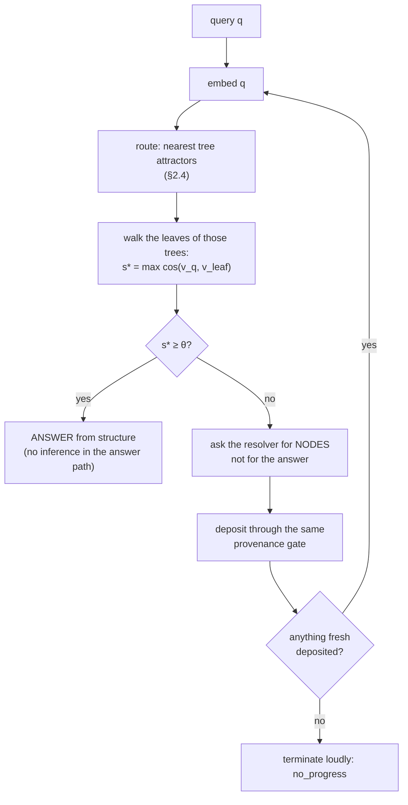

# The memory system: graph trees as an inference cache

*A technical brief.*

**Audience:** someone who builds AI systems for a living and wants the mechanism,
not the pitch. Math where math is clearer than prose.
**Author:** Akien Maciain · **Status:** final · **Date:** 2026-08-05

---

## How to read this

This brief describes the memory architecture **as intended**, because the
intention is the thing that is explainable and the thing worth evaluating. The
implementation is at different depths in different places, since we adopted our
new approach.

So: where a mechanism is running and has been measured, the measurement appears
with its actual numbers, including the ones that came out badly. Where a
mechanism is designed and not yet built, one line says so. Nothing here is
claimed as running that isn't running. That discipline is not modesty — it is
the system's third law (*"nothing is known until measured; an unmeasured claim
is a hypothesis and is labeled as one"*), and the brief is written under it.

---

## 0. The one-paragraph version

An LLM is the most expensive component in any system that contains one, and the
conventional architecture throws away everything it produces the moment the
response is rendered. We treat every answered question as something that should
become **structure** — a node holding one claim with its provenance, indexed by
leaves in graph trees so it is addressable and cheap to reach again. A query is
answered by **walking the graph**. Inference
is what we spend when the walk fails, and when we spend it we do not ask the model
for the answer; we ask it for **the nodes that would let the graph answer**, deposit
those, and resubmit the original question. The proof that the expansion worked is
that structure now resolves the question. Around that loop sits a uniform
component pattern — a **Learning Block** — whose job is to move judgment down a
ladder: from the model, to the graph, to plain code. The rate at which judgment
moves down that ladder is the system's top-level metric.

---

## 1. Why this shape and not RAG

You will recognize pieces of this. The distinction is worth putting up front,
because it determines everything downstream.

| | Retrieval-augmented generation | Semantic answer cache | **This** |
|---|---|---|---|
| What is stored | documents / chunks | question → answer pairs | **nodes: one claim each, with provenance** |
| What retrieval is for | build context **for** the model | skip the model on a near-repeat | **produce the answer itself** |
| Where the answer comes from | the model, conditioned on retrieval | the stored answer text | **the walk** |
| What the model is asked for | the answer | nothing (on a hit) | **structure, on a miss** |
| What a miss costs you | a full generation, every time | a full generation, every time | **a generation, once — then the graph covers that neighborhood** |

RAG makes the model better-informed. A semantic cache makes repeats free. Neither
one gets *cheaper at the shape of the problem* over time, because neither one
converts the generation into anything the retrieval layer can use next time.

The bet here is narrow and testable: **if the model's output is deposited as
structure rather than rendered as prose, the retrieval layer's competence grows
monotonically with use, and the resolver is spent only on genuine novelty.**

That is the whole thesis. Everything below is mechanism.

---

## 2. Section A — the graph trees as a cache

### 2.1 Three layers: the node, the embedding, and the leaf

This distinction is the one to get right before anything else, because almost
every confusion downstream is a collapse of these into one.

```
node = {                    # THE THING BEING REMEMBERED
  content:    text          — one claim, in natural language
  provenance: {source, ...} — where it came from, always
  standing:   "hypothesis" | "earned"
}                           # has an IDENTITY. Never belongs to a tree.

embedding = {               # A RENDERING OF IT, AS COORDINATES
  node:       → a node's identity — and the node points back
  vector:     float[d]      — one way of putting that claim in space
}                           # MANY PER NODE. Derived, therefore regenerable.

leaf = {                    # THE THING INDEXING IT
  embedding:  → one embedding
  weights, edges: → other leaf addresses, two-way
}                           # has an ADDRESS: database.tree.leaf
```

**A node is what is remembered. An embedding is one way of rendering it as
coordinates. A leaf is how it is found.** The address
`database.tree.leaf` is a *locator*, and it changes when a tree reorganizes. The
node's identity does not. One node can be indexed by many leaves in many trees —
differently in the name of different needs, and what lets the same claim sit in
different neighborhoods depending on which axis you are asking along.

**Why the embedding is its own layer and not a column on the leaf.** A leaf was
doing two unrelated jobs at once — holding the coordinates *and* holding the
connections — and separating them buys three things that are otherwise awkward or
impossible:

- **A node can have more than one rendering.** The measured defect in §2.5 is a
  diagram-shaped passage that ranks poorly against a prose question it directly
  answers. With one vector per node you must *choose* which rendering wins; with
  many you keep the raw and the prose rendering both, and retrieval sees both.
- **The thorough tier gets a table to run on.** An exhaustive search over the
  embedding layer needs no trees at all (§2.6), which is what makes it an
  independent second mechanism rather than a slower path through the same one.
- **It settles where the vector lives** — a question §4.4 previously carried open.
  Neither node nor leaf: its own layer, that both point at.

And an embedding is *derived*. Regenerate it from the node and you get it back;
nothing about it is a record of truth. That matters in §4.4, where it means the
only layer index maintenance can reach is the one that is cheap to rebuild.

Three properties of the node layer:

- **One claim per node.** A node holding three claims cannot be cited, corrected,
  or expired independently of the other two.
- **Provenance is a gate, not a field.** The deposit door *refuses* a node nobody
  can trace. The reason is asymmetric cost: a fabricated attribution in a draft is
  a bad afternoon; in a graph node it is a permanent resident that every future
  walk may ground on.
- **Every node is born a hypothesis.** Nothing is trusted because it was written
  down. Tenure — the promotion from `hypothesis` to `earned` — has to be paid for
  by resolving questions. (See §2.6; this loop is designed and **not yet built**,
  and until it is, every node in the store honestly still reads `hypothesis`.)

And one property of the leaf layer that pays off in §4.4: because reorganization
touches only leaves, **index maintenance can never damage a record of truth.**
The trees can be split, renumbered and rebuilt as often as you like; provenance
cannot drift, because provenance is not in the layer that moves.

*(The running store has made none of this split yet — it is one table where the
node, the vector and the leaf are all the same row. §4 says what that costs.)*

### 2.2 The core loop



Four properties of that loop are the design, and each was put there against a
specific failure:

1. **The answer never comes from the generation.** On a miss the model supplies
   candidate nodes; the *original* question is then resubmitted against the
   enlarged graph. If it still misses, the expansion failed and we say so. A
   system that quietly returns the model's prose on a miss is a chatbot wearing a
   librarian's charter, and it can never demonstrate that the graph learned
   anything.
2. **The expansion is cache-safe.** The backfill request carries a digest of the
   tree's membership, so *same question + changed graph = different cache key*.
   Without that, the second round of a backfill loop hits the cached first-round
   response and the loop livelocks forever. This is enforced at the key, not by
   convention.
3. **No-progress terminates loudly.** A round that deposits nothing fresh ends
   with a named verdict, not a retry.
4. **The floor θ is a labeled guess.** θ = 0.65, seeded by exactly one live walk
   (correct node at 0.7473, adjacent at 0.6278). It is returned inside every
   verdict so no caller can mistake it for a settled constant. It is meant to be
   tuned against real traffic.

**Measured, first live crossing (2026-07-27):** a question the tree could not
ground → one backfill, one fresh node deposited → the original question resolved
through structure at cosine 0.8568. Second crossing of the same question: zero
backfills, zero inference in the answer path.

That is n=1. It is the mechanism demonstrated end to end, not evidence about hit
rates at scale.

### 2.3 The cost model

Let

- $c_g$ = cost of one generation (tokens, latency, dollars),
- $c_w$ = cost of one walk,
- $h_t$ = hit rate at time $t$,
- $d$ = embedding dimension, $n$ = leaves in the walked tree.

Then expected cost per query is

$$E[c] = h_t \cdot c_w + (1 - h_t)\,(c_g + c_w \cdot r)$$

where $r$ is the number of resubmission rounds a miss takes (empirically 1 so far;
bounded by `max_backfills`).

Two things make this interesting rather than trivial:

**$h_t$ is non-decreasing under a stationary question distribution.** Every miss
deposits. Nothing is evicted (the store is append-only; a node leaves only by
failing tenure, which is a *quality* decision, never a capacity one). So the
system is strictly amortizing.

**Neighborhood generalization is what the embedding buys.** An exact-match answer
cache makes the second *identical* question free. This makes the second *nearby*
question free — the miss deposits nodes that cover a region of the question space,
not a point in it. This is also exactly where the design can be wrong (§2.6), and
we have measured it being wrong.

**What honest convergence looks like.** Question traffic is heavy-tailed. So the
expectation is not $h_t \to 1$; it is $h_t \to$ the head-mass of the distribution,
fast, and then a long slow climb on the tail. The claim to test is that the
resolver spend per unit of *novel* work falls, not that it goes to zero.

### 2.4 The vector *is* the path — and calving is what creates it

Similarity structure **is** stored — **bounded and weighted**. Two claims get
welded together here, and only one of them is carried by the measurement. What
killed the previous build (§4.0) was an edge structure with **no bound per item**:
2.5 M bigram edges over 70,000 words and climbing, so the work of ingesting one
memory grew with everything already learned. *Unboundedness* is what is ruled out.

A neighbor list capped at $k$ is a different object with different arithmetic. At
$k = 8$, a calve moving half of a 5,000-leaf tree rewrites on the order of tens of
thousands of link entries — the same order as the ~10,000 §4.4 already accepts for
articulated edges at degree 4 — and that number does not move when the corpus
doubles. Bounded degree is exactly the property the dead build lacked.
*(Arithmetic, not a measurement. Law 3 — and it is cheap to check.)*

So how does a walk have a *path*? Two decisions and one learned structure:

1. **Which tree** — compare the query against each tree's *dominant attractor*
   (the centroid of its leaves).
2. **Which leaves within it** — follow the weighted links, and fall back to
   comparing against the tree's leaf vectors when they come up short.

**The weights are the index.** Paths that resolve get stronger, so the *route*
improves with use and not merely the contents. This is the difference between a
memory that grows and a memory that learns: with derivation alone the corpus gets
larger while the retrieval mechanism stays exactly as good — and exactly as
expensive — at query #1,000,000 as at query #1. Inference spent once compiles into
the index itself, instead of into one more row a brute-force comparison must still
find. A cosine scan over a partition is not an index; it is the absence of one.

Weights are stored state that has to survive a renumbering, which by §2.6's own
rule puts them on the **stored** side of the line — so the two-way shear machinery
in §4.4 already covers them, and no new maintenance mechanism is owed.

*(Status, under Law 3: none of the above is built. `nearest()` today loads every
leaf in the tree and sorts by cosine, so the running "walk" is exactly two
comparisons — which tree, which leaf — over a scan. Until weights land, the title
of this section is a design claim and not an earned one, and falsifier 7 is the
test that would earn it.)*

**The arithmetic, and it is not about multiply-adds.** At $d = 768$, float32,
$N = 2.5\text{M}$ leaves, bound $B = 5{,}000$ → about 500 trees:

| what a query touches | bytes |
|---|---|
| flat, over every leaf in the corpus | $2.5\text{M} \times 768 \times 4$ = **7.7 GB** |
| the tree attractors | $500 \times 768 \times 4$ = 1.5 MB |
| one tree's leaves | $5{,}000 \times 768 \times 4$ = 15 MB |
| **two-level total** | **≈ 16.5 MB** |

The ratio (~470×) is not the interesting number. The interesting number is that
**7.7 GB per query fits nowhere and 16.5 MB sits in cache and stays hot.** That is
the difference between a memory that answers in milliseconds and one that streams
RAM on every question.

**Which reframes what calving is for.** It is tempting to read the bound as a cost
cap — keep the tree small so the walk stays cheap. It is the other way round:
**calving along dominant attractors is the operation that creates the path.**
Before the first calve a tree is flat and there is no route to walk, only a scan.
Each calve mints an attractor, and an attractor is what a query steers by. The
cost bound is a side effect of building structure, not the reason for it.

Two consequences worth stating:

- **A tree needs a dominant-attractor vector of its own** — a tree-level object a
  query compares against before it touches any leaf. (The running store has no
  place for one; §4.)
- **Flat-over-trees is fine for a long time.** 500 attractors is 1.5 MB. You would
  not want a tree *of* trees until roughly 100,000 trees, which is 500 M leaves.
  There is no hierarchy to build yet.

*(Today the walk is O(n) in Python, correct and slow, over a single flat store,
and every deposit re-reads it for a dimension check. `pgvector` — proximity
computed where the vectors live, both exact and approximate — is **precedent, not
speculation**: it is what the predecessor system in §4.0 ran on, and it is the
off-the-shelf answer for the thorough tier in §2.6. It is still not installed
here.)*

### 2.5 The three intake paths

The loop above is one of three ways nodes arrive. All three deposit through **the
same door**, which is the point: there is one provenance gate, one dimension
check, one dedupe rule, and no privileged writer.

#### (a1) Inference failover — "give me the nodes to understand this"

Covered in §2.2. The graph's own miss is the trigger. This is the path that makes
the system self-extending: novelty in the query stream becomes structure without
anyone curating anything.

#### (a2) Learning from our own operating logs

The system watches itself work. Two mechanisms, both running:

- **The trace organ.** Every Learning Block firing writes a trace — *green
  firings included* — and each trace is **consumer-typed at write time**:
  `debug`, `training`, or `tree-primary`. No consumer named, no trace written
  (this is what stops trace-drain). `debug` records expire at 30 days, swept by
  the *next write* rather than by a clock. `tree-primary` means: this trace is
  primary data destined for the graph.

  A `training`-typed trace records the full state of a decision — the input, the
  candidates considered, **the constraint that killed each loser**, why the
  winner won, and what escalated to where. The lived symptom that forced this:
  reasoning that lived only in a session's attention was lost the moment the
  model changed underneath it. A trace makes that reasoning a record any model
  can read back.

- **Transcript and command capture.** A flight recorder wraps command execution
  (every run leaves a durable record of what it tried, what came back, and what
  it returned — green or not), and a transcript scanner measures a specific
  defect shape across sessions. Sample number, so you can see the register we
  work in: **466 turns scanned, 7 instances, 1.5%.** The greens are counted on
  purpose — a rate needs a denominator, and a system that only records surprises
  cannot compute one.

#### (a3) Learning from reading

Two verbs, deliberately split:

- **SHELVE** — take a copy, freeze it, register its digest, and give it a
  **stable citable address**. Re-shelving identical content writes nothing.
  Different content arriving at a standing address is **refused**: an address must
  not rot, because provenance anchors point *into* it. Shelving does not touch
  the graph.
- **LEARN** — fold a shelved file into the graph passage by passage. Each node
  deposits anchored to `{source: library:<address>, passage: p<n>, sha256}`, cited
  by **raw** paragraph position so that filtering never renumbers a citation out
  from under itself.

The rule underneath: **the graph is the catalog, not the shelf.** The bytes live
in the library; the graph holds claims that point at them.

*Measured, 2026-07-27:* the founding collection shelved whole (134 files, 41 MB,
zero failures; re-shelve was all duplicates and wrote nothing), one document
learned into 16 anchored passages, and a question about its content resolved at
0.7813 with the source passage riding the walk at 0.6177, citation intact.

*And the finding that came with it:* **diagram-shaped passages rank poorly.** A
flow diagram (arrows, numbered steps) scored 0.4943 against a prose question it
directly answers — *below* two less relevant prose passages. Structured layout
does not embed like the prose it depicts. The fix is a prose rendering before
embedding, not a lower floor — and with the embedding layer of §2.1 it stops
being a choice: keep the raw rendering *and* the prose one, both pointing at the
one node, and let retrieval find whichever the question is shaped like. One vector
per node forces you to pick which rendering wins; many does not.

### 2.6 How nodes are deposited, indexed, and retrieved

**Deposit** — one door, five checks, in order:

1. **Provenance gate.** No traceable source → refused. Not logged-and-accepted; refused.
2. **Content floor.** Below a minimum length → refused. A node distilled from
   near-nothing is invention wearing a vector.
3. **Dimension physics.** The first deposit into a tree fixes its dimension. A
   mismatched deposit *or query* is refused loudly. A 4-dim query against 768-dim
   nodes is a wrong question, and answering it would return a confident wrong
   answer.
4. **Identity.** `node_id = hash(normalized content)`, per database. Content-
   addressed and **tree-free**, so the same claim is the same node no matter how
   many trees index it. (Identity is not address: the address is the leaf's, and
   only the leaf's.)
5. **Dedupe.** A duplicate writes **nothing** and says so. The cheapest deposit is
   the one never made.

*Known defect, filed:* a duplicate currently **drops its new provenance**. But a
second independent source saying the same thing is *corroboration*, which is
precisely the evidence tenure needs. The correct behavior is a provenance append,
and it lands with the tenure loop.

**Index** — the leaf layer *is* the index, and it holds two kinds of connection
that are worth keeping apart:

- **Similarity edges: learned — bounded, weighted, stored.** Each leaf keeps a
  short neighbor list, $k$ entries and not $n$, and each entry carries a weight
  that moves with use.

  The argument that once ruled this out was **single-record integrity**: a stored
  similarity table is a second record of a truth the vectors already contain, and
  two records of one truth drift. That argument is correct — *about an unweighted
  table*. An unweighted neighbor list is pure redundancy: recomputable from the
  vectors, so it can only ever drift away from them, and it buys nothing for the
  risk. A **weight** is not recomputable from the vectors. It is the record of
  what actually resolved, which no amount of cosine will tell you. It is a first
  record of something new, not a second record of something old — and it is the
  only place the index's own learning can live.
- **Articulated edges: authored — stored, directed, and two-way.** *This node
  cites that passage*, *this summary rendered those leaves*. They live leaf-to-leaf
  with both halves present.

Both kinds are now stored, so **the maintenance rule is the same for both** — the
one §4.4 decides: *an edge that must survive a renumbering is an edge you are
storing.* Weights must survive one, so similarity edges ride the same shear the
articulated ones do. What still separates the two kinds is not cost but
**authorship**: an articulated edge is *asserted* by someone and is wrong if it
misstates them; a similarity edge is *learned* from proximity and use, and is
wrong only if it stops predicting. And the clean rule underneath holds unchanged:
*edges are a property of the index, never of the remembered thing.* Nodes have no
edges at all.

**Retrieve — three tiers, which is §3.5's recursion turned on retrieval itself.**
The strata ladder says judgment should migrate from the model to the tree to code;
run that on the act of finding things and you get:

1. **The weighted path** — compiled, near-free. For routes that have proven out.
2. **The scan** — exhaustive cosine over the leaves in scope, or over the
   embedding layer directly with no tree involved at all. Slower, and it **cannot
   miss**: a comparison against everything has no reachability condition, where a
   traversal reaches only what it happens to be linked to. This is the tier you
   *fall back to*, and it is never the tier you replace. Its thoroughness is the
   whole reason it is worth its cost.
3. **Inference** — genuine novelty; the backfill loop of §2.2.

There is also a fourth thing that is not a tier of the same ladder but belongs
beside it: **lexical search over node content** — the literal string match. It
catches exact terms, names, identifiers and quoted phrases, which is to say the
things embeddings routinely smear away. It is the only one of these that finds
what vectors *structurally* cannot, and it is nearly free.

**How often tier 2 fires is itself a dial**, and one of the more informative ones:
if the fallback fires constantly, the weighted index is not learning, and §4.0's
wall has been rebuilt with extra steps. Tier 2 is affordable exactly as long as it
stays rare — scan every embedding in the corpus on every query and you are back at
§2.4's 7.7 GB, the number that fits nowhere.

The verbs themselves: `nearest(v, k)` over the routed trees, `neighbors(leaf, k)`,
and `tree_state(tree)` = a digest that is a pure function of membership (this is
the value that makes the backfill cache key safe).

**And a fourth verb: SUMMARIZE**, the transducer across the storage axis. It takes
a *dense region* of the graph — the k nearest source nodes around a question — and
renders it as articulated prose. Three physics constraints make it a memory
operation rather than a generation:

1. **Citations are code-built from the walked region.** The model may only place
   the marks `[n]`; the bibliography is assembled from what the walk actually
   returned. An unanchored draft, or a citation naming a node the region never
   held, is refused loudly with the raw output carried whole.
2. **The prose deposits back** into the same tree, its provenance naming the exact
   nodes it rendered plus the region's digest. So a summary is a *view over the
   graph that the graph then remembers* — a follow-up is a walk, not a re-render.
3. **The transducer never eats its own output.** Gathering excludes
   summary-sourced nodes. Without this you get a photocopy of a photocopy, and
   the verb stops being idempotent.

### 2.7 The measured finding that matters most

This is the one to take seriously, and it is a negative result about our own
design.

**Backfill nodes have a home-field advantage.** Nodes minted during a backfill are
generated *from the question*, so they are born question-shaped and win the
similarity race for that question. Measured twice on 2026-07-27:

- On a follow-up question, three labels minted during that crossing outranked both
  a landed summary (4th, 0.5960) **and every real shelved passage**.
- Asked about a topic the walked tree genuinely did not contain, the loop
  backfilled three mints and **"resolved" at 0.8295 on them — and the content of
  those mints was wrong.**

So the failure mode is not "the graph doesn't know." It is worse:
**self-backfilling retrieval can manufacture resolution where the graph held
nothing.** Everything remained traceable (`source: llm-backfill`,
`standing: hypothesis`), so the verdict was honest about its sources — but a
consumer reading only the verdict line would have called that answered.

Three consequences, all now designed in:

1. **Tenure is not optional.** A question-echo node must *earn residence by
   resolving questions it was not minted from*, or expire. This is the tier-2
   novelty mechanism, and it is the thing between "self-extending" and
   "self-confirming."
2. **Cross-tree resolution is a real requirement**, not a nicety — in the second
   case, another tree in the system *could* have answered, and the loop never
   looked.
3. **A high cosine is not evidence of knowledge** when the nodes carrying it were
   minted from the query. The score has to be computed with those nodes excluded.

We consider this the most useful thing we have measured, and it generalizes to
anyone building a self-extending retrieval system.

### 2.8 Its twin, which we have *not* measured

Stated separately because the honesty contract requires it: **the following is a
prediction derived from §2.4's routing step, not an observation.** We include it
because it is cheap to test and expensive to discover late.

Once a walk begins with *choosing a tree*, the choice can be wrong — and a wrong
choice produces a low $s^*$, which is exactly the trigger for backfill. So **a
routing error is indistinguishable from genuine novelty.** The system mints nodes
for something it already knows, files them in the wrong neighborhood, and those
mints then win the similarity race for their own question next time.

That is the mirror of §2.7. Manufactured *resolution* is a high score that is not
evidence. Manufactured *novelty* is a miss that is not absence — and it is the
worse of the two, because it compounds: every routing miss deposits material that
makes the wrong tree slightly more attractive.

Both the softener and the instrument are cheap:

- **Probe the top-$k$ trees, not the top one.** At $k = 5$ a walk touches 75 MB
  instead of 15 MB — still nothing.
- **Measure router recall@$k$ directly**: take queries whose correct leaf is known
  and count how often the router lands on its tree. A retrieval system that
  extends itself needs this number before it needs almost anything else.

---

## 3. Section B — Stackable Learning Blocks

### 3.1 The anatomy

Every unit of work in the system — a component, a workflow step, and ultimately
the system as a whole — is built to one shape. Five organs:

| organ | what it does | the failure it prevents |
|---|---|---|
| **DOOR** | declares an input contract; refuses insufficient input with **every** lack named in one pass | work that proceeds on a bad premise and fails three steps later |
| **TRACE** | records every firing, green included, consumer-typed at write | reasoning that evaporates with the session; rates with no denominator |
| **FINDING** | exit-time bullet list, each bullet tagged with the **stratum** that produced it: `code` \| `tree` \| `hex` | a claim whose origin you cannot audit |
| **VERDICT** | a human approves / disproves / questions the finding — recorded with their verbatim words | judgment that trains nothing because it wasn't captured |
| **DIAL** | per-block counters: firings, send-backs, approvals, disproves, **match rate** | delegating on vibes |

Two implementation properties make these *stackable* rather than a naming
convention:

- **One engine, many blocks.** The inner loop — *input → candidate generation →
  evaluation → decide or escalate* — is instantiated from a **data-only block
  spec**. The engine is branchless about which block it is running. A
  block-specific branch in engine code **falsifies the design**, and there is a
  test that compares the engine module's bytes across two different tenants'
  firings to prove it.
- **The contract lives in the block's own charter**, not in engine code. Adding
  the next block is a declaration, not a code change.

### 3.2 The gate, and why a human is standing in it

The system's owner is currently the inspector and the memory: he reads the
finding, asks questions, approves or disproves. That is not a stopgap dressed as
a design — it is the design's starting condition, and it is stated as such:

> *"we start with me owning all gates and i approve the pass. but we change how
> that works: rather than the long brief, a bullet list finding from an inspector
> for that step that learns what **I** will gate. eventually i delegate it."*

Each verdict is a **labeled training pair**: (finding, human judgment, verbatim
reasoning). The dial computes the match rate between what the inspector predicted
he would gate and what he actually gated. **Delegation happens when that rate
crosses a threshold he sets** — and there is a **demotion door**: a delegated gate
that starts surprising him comes back to his desk.

Two guardrails, non-negotiable and structural rather than advisory:

- **Asymmetric evidence.** Counter-evidence lowers a gate's autonomy faster than
  confirmation raises it.
- **Ceilinged gates.** Irreversible or outward-facing gates carry a confidence
  ceiling *below* the autonomy threshold. They never auto-open, however much
  evidence accumulates. This is a structured field the fold reads, not a phrase
  in a comment.
- And: **silence is not approval.** Absence of a correction is weak evidence at
  most.

### 3.3 The Leah rule — why greens are recorded

Named for a lesson about self-observation: someone notices a thing once, concludes
from it, and shares the conclusion — and the useful question is *"is that your only
data point?"*, which sends them looking for the second instance.

Formally: **surprise routes; greens are the denominator.** Errors decide what
travels up the hierarchy (this is predictive-processing-shaped, and deliberately
so — a send-back *is* a prediction error, so gates fire on mismatch, never on a
schedule). But yield is hits-over-firings, and it is uncomputable without
recording the unsurprising firings. Hence: every firing traced, green included.

The corresponding failure mode is known and pre-empted: the andon cord (any
station stops the line; causes fixed at source; the line stops *less* over time)
solved this a century ago, and its documented pathologies are alarm fatigue and
gaming. So **refusal rates are themselves measured from day one.** A block that
never refuses is vacuous; one that refuses constantly is mis-gated. Without that
measurement, evasion just moves up a level — past gates instead of past questions.

### 3.4 How the blocks use the graph trees

This is the join between Section A and Section B, and it is the mechanism behind
the word *learning* in Learning Block.

**Three strata, and judgment migrates down them:**

```
   ceiling:  the LLM        — expensive, general, spent on the novel
     ↓
   middle:   the graph tree — cheap, specific, grows from what the ceiling produced
     ↓
   floor:    plain code     — free, exact, for what has stopped being a judgment call
```

A block's judgment starts at the ceiling. Its traces and verdicts deposit as nodes
(`tree-primary` typing exists exactly for this). Once the graph resolves a class of
judgment reliably, the block reads it from the tree instead of the model. Once a
judgment stops being a judgment — once the answer is always the same — it compiles
to code, where it costs nothing and cannot drift.

**The stratum tag on every finding bullet is the instrument.** Each assertion
records which layer produced it. So the migration is not an impression; it is a
countable distribution over `code | tree | hex`, per block, over time.

**The system's top-level metric follows directly: the migration rate.** How much
adjudication moved from ceiling to tree or code, per week. That single number is
the operational meaning of "self-improving" — and it is falsifiable. If judgment
is not moving down the ladder, the architecture is not doing the thing it claims.

### 3.5 The recursion

The last move is the one that took longest to see: **the whole system is a
learning block.** Map the five organs to the system scale and two of them are
currently a human brain —

| organ | at system scale, today |
|---|---|
| door | the refusal surfaces, plus the question set they exist to answer |
| trace | the wires, landing component by component |
| **finding** | **a human — he is the inspector** |
| verdict | his gate acts, now captured verbatim |
| **dial** | **a human — he is the memory** |

So the program is not "add learning blocks to things." It is **move the inspector
and the memory out of a person's head and into the system's own organs** — and the
migration rate is how you tell whether it is happening.

**And the recursion has a second place to land, one layer down: retrieval itself.**
Run the same three strata on the act of finding something and you get the weighted
path, the scan, and inference (§2.6) — which makes retrieval a learning block in
its own right, measured by the same migration rate as everything else, rather than
a fixed mechanism the learning blocks merely call.

---

## 4. Section C — graph tree structure and the database optimizations

### 4.0 The load problem this came from

The ideas in this section came from a system that was built the ordinary way and
died. The numbers are worth having in front of you, because they set where the
burden of proof sits.

The conventional build — conventional tables, a stored edge table — reached
**70,000 words and 2.5 M bigram edges**, at which point **every single edge update
took over 30 seconds.**

The mechanism is unremarkable, which is the point. Ingesting one memory means many
`UPDATE`s against a 2.5 M-row edge table: each an index seek or a scan, each taking
a write lock, each syncing. And **the cost grows with the corpus.** The system got
slower exactly as it learned more, which is the one direction a memory must not
move. A different engine buys perhaps an order of magnitude and then meets the same
wall, because the wall is not the engine.

**Name the wall precisely, because it is easy to name too broadly.** The wall is
*a link structure with no bound per item* — 2.5 M edges over 70,000 words, the
work of each ingest rising with everything already learned. It is **not** "storing
links at all." Reading it the broad way is how you end up forbidding the one thing
that would make the index learn (§2.4), on the authority of a number that never
measured it. A structure capped at $k$ links per leaf has none of the mechanism
above: $k$ is a constant, and a constant does not care how much the system knows.

So the design makes one trade, and everything in §4 follows from it:

| | write cost | read cost |
|---|---|---|
| unbounded edges | **grows with the corpus** | cheap |
| bounded edges + bounded trees | **constant in corpus size** | bounded by the bound, not the corpus |

The operative word is **unbounded**, not *stored*. Adding a memory writes one node
row, one embedding row, one leaf row, and a neighbor list of $k$ entries — $k$
being a constant we choose, where the build that died wrote a list that grew with
everything it had ever learned. Nothing whose size depends on the corpus is
touched. The price moved from write time to read time, and at read time it is
capped by the calving bound instead of by how much has been learned.

This is also why the falsifier at the end of this section names 2.5 M nodes. That
is not a projected scale — it is the corpus size at which the previous build died.
Re-running there is re-running the thing that failed.

### 4.1 One owner per store; one node list per database

Every table has exactly one owner, and **the owner gates every write**. This is
enforced as a schema constraint plus a single connection-holding module — a table
with no owner cannot come into existence, and there is no second door. Not a
convention, not a code review rule: a `CHECK` in the database and one module that
holds the connection.

Within a database there is **one node list** — one table of remembered things,
shared by every tree above it, and *not* partitioned by tree. Nodes are the
substrate; what varies is how they are indexed.

### 4.2 Trees get their own tables — of leaves

Each tree is a **physical table of leaves**, not a row in a table of trees. The
node list sits underneath, unpartitioned; each tree table indexes into it.

This is the load-bearing choice, and the obvious objection is "then cross-tree
edges are expensive." Under this design they are not — see §4.3. What per-tree
leaf tables buy:

- The walk is bounded by the *tree*, not the corpus (§2.4).
- Calving is a table operation on leaves, not a mass rewrite of remembered things.
- Two different tree sets can index **one node set** — the same claims organized
  along different axes, with no duplication of the claims themselves. This used to
  rest on the vector living on the *leaf* — the worry being that a node-side vector
  would place that node at identical coordinates in every tree, so a second tree
  set would buy nothing. The embedding layer (§2.1) removes the worry rather than
  answering it: a node with several renderings has several placements natively,
  and the leaf is free to be purely an address with connections on it.

The default is **private-down, grant-up**: a tree indexes into what is below it
privately, and reaching upward into shared material is an explicit grant.

### 4.3 Leaf addresses are `database.tree.leaf`

A leaf's address **carries its table**. Consequences:

- Reaching a leaf is **addressing, not searching**. No index traversal, no lookup
  by content, no growth in access variance as the graph grows. That constant-time,
  constant-variance property is the whole point of the design — it is what
  30-seconds-per-edge-update was the symptom of losing.
- **A cross-tree link is just a leaf address with a different table part.** The
  standard objection to per-tree tables — "you'll need an edge index to cross
  trees" — assumes you must *search* for edges. Addressing eliminates the search,
  so the objection does not bind against this design specifically.
- **And the address is not an identity.** A leaf has both: an identity of its own
  and an address that can change. The node it points at has only an identity. Keep
  these apart and calving is cheap; collapse them and every reorganization becomes
  a re-identification pass across the whole corpus.

### 4.4 Trees calve on dominant attractors, and the shear runs on two-way links

A tree that grows past its bound **calves**: it splits along the **dominant
attractors** — the regions the content has actually clustered into, rather than an
arbitrary partition. A **shear** then renumbers leaf addresses along the split.

**Why the links are two-way.** A moved leaf leaves stale pointers behind it, and
the question is how you find their holders. Because every articulated edge is
mirrored, **a moved leaf's in-link list *is* the exact set of holders** — the
affected set is not merely small, it is *addressable*. One-way, that set exists
with no address, and you find it by reading every leaf's out-links in the
database: the searching this whole design exists to eliminate, reappearing in the
reverse direction.

The cost difference compounds. With bound $B$ and corpus $N$, growing to $N$ costs
about $N/B$ calves:

| | per calve | over growth to $N$ |
|---|---|---|
| one-way links | full scan, $O(N)$ | $O(N^2 g / B)$ |
| two-way links | incident edges only, $O(B\,g)$ | $O(N g)$ |

At $B = 5{,}000$, $N = 2.5\text{M}$, articulated degree $g \approx 4$: about 500
calves, ~10,000 edge-entry rewrites each. Quadratic versus linear — and the
quadratic version gets expensive precisely as the corpus grows large enough to
need calving.

**And the property that matters most: a calve never touches a node.** It is a pure
leaf operation. The things being remembered are not read and not written. Index
maintenance cannot damage a record of truth because it never reaches one.

The embedding layer makes that argument *stronger* rather than complicating it. A
calve may well have to touch an embedding's back-references — and that is the
acceptable case, because an embedding is derived: damage one and you regenerate it
from the node. A node cannot be regenerated from anything. So the deepest layer
index maintenance can reach is exactly the layer that is cheap to rebuild, and the
layer it must never reach is the one it structurally cannot.

Three further notes:

- **The bound** is provisionally 5,000 leaves. An earlier generation used 1,000,
  which is evidence the threshold moves with the content — a parameter to learn,
  not a constant to enshrine. (One bound or two — size *and* depth — is open.)
- **Splitting on attractors rather than on size alone** is what keeps each
  post-calve tree semantically coherent, which is what keeps *routing* (§2.4)
  tractable. A split down the middle of a cluster pushes the routing cost straight
  back up.
- **Both halves of a link need one door.** If the out-half and in-half can be
  written separately they can drift, and a drifted back-reference means the shear
  misses a leaf — whose stale pointer then does not dangle but *silently
  retargets* to whatever now occupies that address. So: one operation writes both
  halves or the link does not exist, and the falsifier is "an out-link with no
  mirror in-link." Cheap insurance regardless: never reuse leaf numbers after a
  shear, so anything missed dangles loudly instead of retargeting quietly.

**Honest status on this section.** The per-tree leaf tables, the bound, and the
shear are the **restore target**. The running store today is a single table in
which the node and the leaf are the same row, with no link columns at all — so
there is currently nothing for a shear to renumber and nowhere for an articulated
edge to live. The node/leaf split is a *prerequisite* for calving, not a detail of
it. What remains open is named rather than papered over:

1. **How fast a weight falls.** A weight that strengthens whenever its path
   resolves is a positive feedback loop, and §2.7 is already a story about one: a
   wrong route that resolves once gets stronger, is likelier to be chosen next
   time, and manufactures its own confirmation with a ratchet on it. The
   correction is the asymmetry §3.2 already demands of gates — **counter-evidence
   lowers a weight faster than confirmation raises it** — and *how much* faster is
   unmeasured. It is a dial, and it is born red.
2. **Cross-tree in-links are cross-owner writes.** If a leaf in tree B points into
   tree T, T's calve must rewrite a row B's owner gates — and under one-owner-per-
   store the shear cannot reach in. Two-way links make this tractable (T knows
   exactly whom to notify) but not free; the fixup still travels through B's gate.
3. **Does a node carry back-references to its leaves?** "Where is this node
   indexed?" is otherwise a lookup against every tree table. Storing the list makes
   it one read — but then a calve *does* write nodes, and the property two
   paragraphs up holds only if it doesn't.
4. **The bound**: one parameter or two.

*(An item that stood on this list until recently — **where the vector lives** — is
now settled rather than quietly dropped: neither node nor leaf, but its own layer,
§2.1.)*

**And the falsifier, which is the part an architect should hold us to:** this must
be measured **at the scale it was designed for** — on the order of 2.5 M nodes —
and it is two-sided, because the baseline is two-sided. Access must not degrade
with graph size, *and* write cost must not grow with corpus size. Proving the shape
on a few hundred rows fails this outright. Our largest live measurement to date is
far below that. Until that test runs, §4 is a design with an unusually good
provenance and no benchmark, and we say so.

---

## 5. Section D — whose work comes closest, and how

Two caveats before the map. First, the survey below started from a secondary
source and has **not been verified against the primary literature**; treat every
"nobody does X" as a hypothesis about the field, not a search result. Second, the
useful question is not "is this novel" but "which existing line of work should we
be reading, and what do they already know that we would otherwise re-derive."

### 5.1 The nearest neighbor: cognitive architectures

**Who:** SOAR (John Laird, Michigan) · ACT-R (Christian Lebiere, CMU) · Sigma
(Paul Rosenbloom, USC) · OpenCog.

This is the closest correspondence and it is close enough to be uncomfortable, in
a good way. SOAR's central loop is **impasse → subgoal → chunking**: when no
operator applies, the architecture creates a subgoal to resolve the impasse, and
the result is *chunked* into a new rule so the same impasse does not recur.

That is structurally our core loop:

| SOAR | here |
|---|---|
| impasse (no operator applies) | similarity floor miss, $s^* < \theta$ |
| subgoal to resolve it | ask the resolver for nodes |
| chunk the result into a rule | deposit nodes; resubmit the original question |
| result: the impasse doesn't recur | result: the walk now resolves it |

**What we add that they don't have:** the resolver is an *external, general* model
rather than the architecture's own problem-solving; the chunk carries **provenance
and a standing**, so it can be doubted and expired; and — this is the real
addition — the failure mode in §2.7. SOAR's chunks are derived from the
architecture's own valid reasoning. Ours are generated by a model conditioned on
the query, which is exactly why they can be question-shaped, wrong, and
self-confirming. Chunking has no analogous problem, so it has no analogous defense,
and **tenure is our answer to a problem their design does not have.**

**What they have that we should read for:** decades of work on chunking's failure
modes, utility-based rule retention (ACT-R's activation and decay equations are
directly relevant to tenure), and the meta-level/object-level split.

**Show this to a cognitive architecture researcher first.** They will recognize the
loop immediately, and they are the people most likely to tell us which of our
"new" problems were solved in 1994.

### 5.2 Neuro-symbolic reasoning

**Who:** IBM's neuro-symbolic group · MIT concept-bottleneck models · DeepMind's
neuro-symbolic work.

**Shared:** vectors and symbols in one system; structure that is inspectable rather
than only distributed. Concept bottlenecks in particular share our "one claim per
node, and it must be nameable" instinct.

**Not shared:** deterministic, question-driven expansion; a gate that *refuses*
insufficient input; provenance as an admission requirement.

### 5.3 Program synthesis and prompt/program compilation

**Who:** Microsoft Research (PROSE) · neural program synthesis work · and in
current practice, **DSPy**-shaped pipeline compilation.

This is the nearest line of work to *"logic migrates from ceiling to tree to
code."* DSPy compiles a pipeline against a metric — and this is the sharpest
contrast in the whole survey:

> **DSPy and its relatives distill model-to-model. We distill
> model-to-structure — into a graph tree, and then into code.**

That is the distinctive bet, and it is the one an outside reviewer should press
hardest on, because model-to-model distillation has a much shorter path to a
working artifact.

### 5.4 Dynamic graph expansion / graph learning

**Who:** Stanford Graph Learning Lab · CMU graph reasoning · DeepMind graph
networks.

**Shared:** modifying graph structure during learning; the machinery for it.
**Not shared:** expansion driven by an explicit question operator, and admission
control on what may join the graph.

### 5.5 Novelty and out-of-distribution detection

**Who:** MIT CSAIL · Stanford AI Lab · Toronto (Bayesian novelty) · DeepMind.

**They are ahead of us and we should borrow.** Our tier-1 novelty detector is a
single cosine threshold seeded from one observation — which is about the crudest
possible instrument. This field has calibrated, uncertainty-aware alternatives.
**What they don't do is grow structure from the detection**; they classify and
stop. That is the gap, and it is a gap we could close by taking their detector and
attaching our expansion protocol to it.

### 5.6 Factored cognition

**Who:** Ought (and Elicit, which runs it over scientific literature).

The prior art for **claim decomposition with evidence** — decomposing a question
into sub-questions whose answers compose. Directly relevant to the question-nexus
idea. Cite, don't graft.

### 5.7 The two industrial neighbors an architect will ask about

*(Our addition to the survey, not from the source material — and the two
comparisons most likely to come up in your review.)*

**GraphRAG (Microsoft) and its descendants.** Builds a graph over a corpus, then
uses it to assemble better context for generation. Genuinely close on the storage
side. The divergence is the direction of the arrow: **GraphRAG builds a graph to
serve the model; here the graph is the answerer and the model is used to grow the
graph.** A GraphRAG system's per-query generation cost does not fall as the graph
improves; ours is designed to.

**Semantic answer caches (GPTCache and friends).** The same idea one level
shallower: embed the query, serve a stored answer on a near-match. The difference
is what gets stored — an *answer* versus the *structure that produces answers*. A
cached answer generalizes to paraphrases of its question. A deposited node
generalizes to any question in its neighborhood, and composes with other nodes to
answer questions no one has asked yet. The tradeoff is honest: caches are simpler
and they work today.

### 5.8 Where that leaves us

The composition — question-driven expansion + admission control on the graph +
tenure as the defense against self-confirmation + judgment that migrates down a
stratum ladder — we have not found assembled anywhere. But that is a claim about
our search, and our search was one secondary source. **The right next step is a
literature pass by someone who reads these venues**, and the right order for
showing the work is: cognitive architecture, then neuro-symbolic, then dynamic
graph learning. If any one of them says "this is new," that is signal. If any one
of them says "we solved that in 2003," that is better signal.

---

## 6. What would falsify all of this

The system holds that a claim without a falsifier is decoration, so here are ours.
These are the questions to ask us in six months.

1. **The migration rate is flat.** If judgment is not measurably moving from the
   model to the graph to code, the Learning Block architecture is overhead with a
   philosophy attached.
2. **Nodes still all read `hypothesis`.** If tenure never lands, standing is a
   decoration and §2.7's failure mode is unmitigated — the graph is
   self-confirming and the resolution numbers mean nothing.
3. **Answers come from inference when the graph already holds the structure.**
   That is the librarian demoted to a vector cache with extra steps.
4. **Node access degrades with graph size at 2.5 M nodes — or write cost grows
   with corpus size.** Either one means the addressing design did not deliver the
   property it exists for, measured against the baseline that motivated it (§4.0),
   and §4 reopens.
5. **Hit rate does not climb** on a real, stationary question stream. The
   amortization argument in §2.3 is the thesis; if $h_t$ is flat, the thesis is
   wrong.
6. **The gates never refuse.** A door that never sends anything back is vacuous,
   and the refusal rate is measured precisely so that this cannot hide.
7. **The composed embedding is no better than the seed embedding.** The walk is
   supposed to *produce* a representation, not merely retrieve with one (§2.4). If
   composing over the walked path beats nothing, the trees are still a defensible
   cache but "the vector becomes the path" is decoration. This is the cheapest
   falsifier on the list and should be run first: take text whose correct node is
   known, compute both vectors, see which one retrieves it.

   **Run it against the weighted route, not against the scan.** Composing over a
   path selected by cosine means averaging vectors already chosen for being near
   the query, so the composed vector lands near the query close to tautologically
   — as specified against today's build, this test is rigged to pass and tells you
   nothing. Weights are what give it something *learned* to compose with, and only
   then is it measuring a claim rather than its own setup.
8. **Router recall@$k$ is poor.** Then §2.8's manufactured novelty is live, tier-1
   miss detection is measuring the router rather than the corpus, and the
   self-extension loop is feeding on its own routing errors.

---

## Appendix — vocabulary

| term | meaning here |
|---|---|
| **node** | the thing remembered: one claim + provenance + standing. Has an identity; belongs to no tree |
| **embedding** | one rendering of a node as coordinates: a vector, its own record, pointing at its node and the node back at it. Many per node; derived, so regenerable |
| **leaf** | the thing indexing a node: address + an embedding + weights + two-way edges. Lives in exactly one tree |
| **tree** | a physical table of *leaves*, organized along one axis, over the shared node list |
| **leaf address** | `database.tree.leaf` — a locator, not an identity; the address carries its table |
| **attractor** | a tree's own vector (its leaves' centroid); what a query steers by when choosing a tree |
| **similarity edge** | learned leaf→leaf link; stored, **bounded** ($k$ per leaf, never unbounded) and **weighted**; the weight is what a cosine cannot recompute |
| **articulated edge** | authored leaf→leaf link; stored, directed, two-way; what a shear repairs |
| **weight** | how much a link has proven out in use; the index's own learning, and the thing that makes retrieval improve rather than merely grow |
| **in-link** | the mirror half of an articulated edge — what makes the shear's affected set addressable |
| **walk** | route to trees by attractor, then follow the weighted links within one — falling back to cosine over the tree's leaves when they come up short |
| **floor (θ)** | the cosine below which a walk is a miss (0.65, a labeled guess) |
| **backfill** | asking the resolver for *nodes*, on a miss — never for the answer |
| **calving** | a tree past its bound splitting along dominant attractors — the operation that creates the path |
| **shear** | the renumbering of leaf addresses along a calve; touches leaves only, never nodes |
| **standing** | `hypothesis` (born) → `earned` (tenure paid) |
| **tenure** | promotion earned by resolving questions the node was not minted from |
| **Learning Block** | door → work → trace → finding → verdict → dial |
| **stratum** | which layer produced an assertion: `code` \| `tree` \| model |
| **migration rate** | how much judgment moved down a stratum per unit time |
