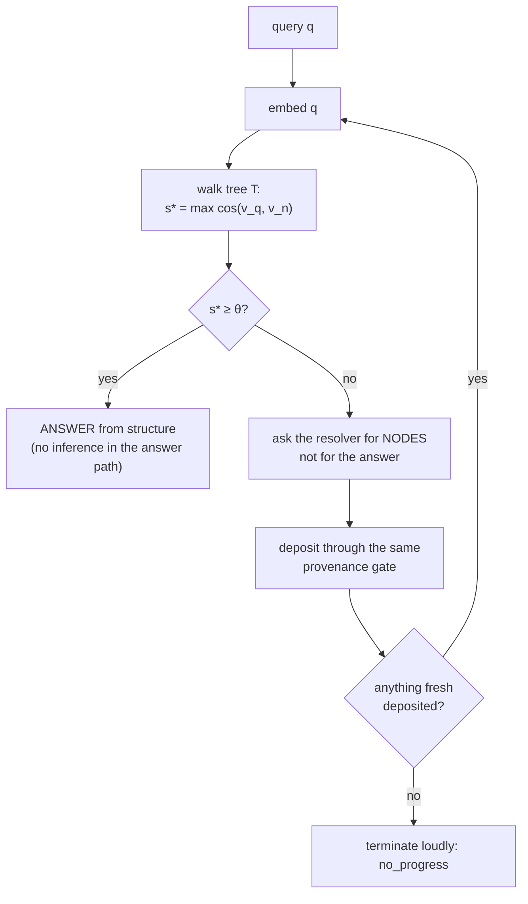

# The memory system: graph trees as an inference cache

*A technical brief for an enterprise architect.*

**Audience:** someone who builds AI systems for a living and wants the mechanism,
not the pitch. Math where math is clearer than prose.
**Author:** Akien MacIain · **Status:** draft, awaiting signature gate · **Date:** 2026-08-05

---

## How to read this

This brief describes the memory architecture **as intended**, because the
intention is the thing that is explainable and the thing worth evaluating. The
implementation is at different depths in different places, and pretending
otherwise would waste your time.

So: where a mechanism is running and has been measured, the measurement appears
with its actual numbers, including the ones that came out badly. Where a
mechanism is designed and not yet built, one line says so. Nothing here is
claimed as running that isn't running. That discipline is not modesty — it is
the system's third law (*"nothing is known until measured; an unmeasured claim
is a hypothesis and is labeled as one"*), and the brief is written under it.

---

## 0. The one-paragraph version

An LLM is the most expensive component in any system that contains one, and the
conventional architecture throws away everything it produces the moment the
response is rendered. We treat every answered question as something that should
become **structure** — a node in a graph tree, addressable, provenance-carrying,
and cheap to reach again. A query is answered by **walking the graph**. Inference
is what we spend when the walk fails, and when we spend it we do not ask the model
for the answer; we ask it for **the nodes that would let the graph answer**, deposit
those, and resubmit the original question. The proof that the expansion worked is
that structure now resolves the question. Around that loop sits a uniform
component pattern — a **Learning Block** — whose job is to move judgment down a
ladder: from the model, to the graph, to plain code. The rate at which judgment
moves down that ladder is the system's top-level metric.

---

## 1. Why this shape and not RAG

You will recognize pieces of this. The distinction is worth putting up front,
because it determines everything downstream.

| | Retrieval-augmented generation | Semantic answer cache | **This** |
|---|---|---|---|
| What is stored | documents / chunks | question → answer pairs | **nodes: one claim each, with provenance** |
| What retrieval is for | build context **for** the model | skip the model on a near-repeat | **produce the answer itself** |
| Where the answer comes from | the model, conditioned on retrieval | the stored answer text | **the walk** |
| What the model is asked for | the answer | nothing (on a hit) | **structure, on a miss** |
| What a miss costs you | a full generation, every time | a full generation, every time | **a generation, once — then the graph covers that neighborhood** |

RAG makes the model better-informed. A semantic cache makes repeats free. Neither
one gets *cheaper at the shape of the problem* over time, because neither one
converts the generation into anything the retrieval layer can use next time.

The bet here is narrow and testable: **if the model's output is deposited as
structure rather than rendered as prose, the retrieval layer's competence grows
monotonically with use, and the resolver is spent only on genuine novelty.**

That is the whole thesis. Everything below is mechanism.

---

## 2. Section A — the graph trees as a cache

### 2.1 What a node is

Four fields, and each one is load-bearing:

```
node = {
  content:    text  — one claim, in natural language
  vector:     float[d] — its embedding
  provenance: {source, ...} — where it came from, always
  standing:   "hypothesis" | "earned"
}
```

- **One claim per node.** A node holding three claims cannot be cited, corrected,
  or expired independently of the other two.
- **Provenance is a gate, not a field.** The deposit door *refuses* a node nobody
  can trace. The reason is asymmetric cost: a fabricated attribution in a draft is
  a bad afternoon; in a graph node it is a permanent resident that every future
  walk may ground on.
- **Every node is born a hypothesis.** Nothing is trusted because it was written
  down. Tenure — the promotion from `hypothesis` to `earned` — has to be paid for
  by resolving questions. (See §2.6; this loop is designed and **not yet built**,
  and until it is, every node in the store honestly still reads `hypothesis`.)

### 2.2 The core loop



Four properties of that loop are the design, and each was put there against a
specific failure:

1. **The answer never comes from the generation.** On a miss the model supplies
   candidate nodes; the *original* question is then resubmitted against the
   enlarged graph. If it still misses, the expansion failed and we say so. A
   system that quietly returns the model's prose on a miss is a chatbot wearing a
   librarian's charter, and it can never demonstrate that the graph learned
   anything.
2. **The expansion is cache-safe.** The backfill request carries a digest of the
   tree's membership, so *same question + changed graph = different cache key*.
   Without that, the second round of a backfill loop hits the cached first-round
   response and the loop livelocks forever. This is enforced at the key, not by
   convention.
3. **No-progress terminates loudly.** A round that deposits nothing fresh ends
   with a named verdict, not a retry.
4. **The floor θ is a labeled guess.** θ = 0.65, seeded by exactly one live walk
   (correct node at 0.7473, adjacent at 0.6278). It is returned inside every
   verdict so no caller can mistake it for a settled constant. It is meant to be
   tuned against real traffic.

**Measured, first live crossing (2026-07-27):** a question the tree could not
ground → one backfill, one fresh node deposited → the original question resolved
through structure at cosine 0.8568. Second crossing of the same question: zero
backfills, zero inference in the answer path.

That is n=1. It is the mechanism demonstrated end to end, not evidence about hit
rates at scale.

### 2.3 The cost model

Let

- $c_g$ = cost of one generation (tokens, latency, dollars),
- $c_w$ = cost of one walk,
- $h_t$ = hit rate at time $t$,
- $d$ = embedding dimension, $n$ = nodes in the walked tree.

Then expected cost per query is

$$E[c] = h_t \cdot c_w + (1 - h_t)\,(c_g + c_w \cdot r)$$

where $r$ is the number of resubmission rounds a miss takes (empirically 1 so far;
bounded by `max_backfills`).

Two things make this interesting rather than trivial:

**$h_t$ is non-decreasing under a stationary question distribution.** Every miss
deposits. Nothing is evicted (the store is append-only; a node leaves only by
failing tenure, which is a *quality* decision, never a capacity one). So the
system is strictly amortizing.

**Neighborhood generalization is what the embedding buys.** An exact-match answer
cache makes the second *identical* question free. This makes the second *nearby*
question free — the miss deposits nodes that cover a region of the question space,
not a point in it. This is also exactly where the design can be wrong (§2.6), and
we have measured it being wrong.

**What honest convergence looks like.** Question traffic is heavy-tailed. So the
expectation is not $h_t \to 1$; it is $h_t \to$ the head-mass of the distribution,
fast, and then a long slow climb on the tail. The claim to test is that the
resolver spend per unit of *novel* work falls, not that it goes to zero.

### 2.4 Walk cost, and why calving pays for it

Edges are **never stored**. `nearest(q, k)` derives them at walk time by cosine
against every node in the tree; `neighbors(n, k)` does the same from a node.
There is no edge table, and the proof asserts that nothing shaped like one is
ever registered.

The arithmetic that makes this defensible — and the arithmetic that eventually
kills it:

| tree size $n$ | multiply-adds per walk ($n \cdot d$, $d = 768$) | verdict |
|---|---|---|
| 5,000 | 3.84 M | microseconds; nothing to maintain, nothing to invalidate |
| 2,500,000 | 1.92 G | no longer free; now you want an index |

So: **the bound on tree size is what pays for having no edge table.** Calving
(§4.4) is not a storage convenience — it is the mechanism that keeps walk cost
$O(B \cdot d)$ with $B$ the bound, instead of $O(N \cdot d)$ with $N$ the whole
corpus. The two design decisions are one decision.

The cost that replaces it is **tree selection** — with $T$ trees you must decide
which to walk. That routing question is open and named as open; it is the same
question as cross-tree resolution in §2.6.

*(Today the walk is O(n) in Python, correct and slow, and every deposit re-reads
the tree for its dimension check. `pgvector` — proximity computed where the
vectors live — is a filed edge waiting on a real load. It is not installed.)*

### 2.5 The three intake paths

The loop above is one of three ways nodes arrive. All three deposit through **the
same door**, which is the point: there is one provenance gate, one dimension
check, one dedupe rule, and no privileged writer.

#### (a1) Inference failover — "give me the nodes to understand this"

Covered in §2.2. The graph's own miss is the trigger. This is the path that makes
the system self-extending: novelty in the query stream becomes structure without
anyone curating anything.

#### (a2) Learning from our own operating logs

The system watches itself work. Two mechanisms, both running:

- **The trace organ.** Every Learning Block firing writes a trace — *green
  firings included* — and each trace is **consumer-typed at write time**:
  `debug`, `training`, or `tree-primary`. No consumer named, no trace written
  (this is what stops trace-drain). `debug` records expire at 30 days, swept by
  the *next write* rather than by a clock. `tree-primary` means: this trace is
  primary data destined for the graph.

  A `training`-typed trace records the full state of a decision — the input, the
  candidates considered, **the constraint that killed each loser**, why the
  winner won, and what escalated to where. The lived symptom that forced this:
  reasoning that lived only in a session's attention was lost the moment the
  model changed underneath it. A trace makes that reasoning a record any model
  can read back.

- **Transcript and command capture.** A flight recorder wraps command execution
  (every run leaves a durable record of what it tried, what came back, and what
  it returned — green or not), and a transcript scanner measures a specific
  defect shape across sessions. Sample number, so you can see the register we
  work in: **466 turns scanned, 7 instances, 1.5%.** The greens are counted on
  purpose — a rate needs a denominator, and a system that only records surprises
  cannot compute one.

#### (a3) Learning from reading

Two verbs, deliberately split:

- **SHELVE** — take a copy, freeze it, register its digest, and give it a
  **stable citable address**. Re-shelving identical content writes nothing.
  Different content arriving at a standing address is **refused**: an address must
  not rot, because provenance anchors point *into* it. Shelving does not touch
  the graph.
- **LEARN** — fold a shelved file into the graph passage by passage. Each node
  deposits anchored to `{source: library:<address>, passage: p<n>, sha256}`, cited
  by **raw** paragraph position so that filtering never renumbers a citation out
  from under itself.

The rule underneath: **the graph is the catalog, not the shelf.** The bytes live
in the library; the graph holds claims that point at them.

*Measured, 2026-07-27:* the founding collection shelved whole (134 files, 41 MB,
zero failures; re-shelve was all duplicates and wrote nothing), one document
learned into 16 anchored passages, and a question about its content resolved at
0.7813 with the source passage riding the walk at 0.6177, citation intact.

*And the finding that came with it:* **diagram-shaped passages rank poorly.** A
flow diagram (arrows, numbered steps) scored 0.4943 against a prose question it
directly answers — *below* two less relevant prose passages. Structured layout
does not embed like the prose it depicts. The fix is a prose rendering before
embedding, not a lower floor.

### 2.6 How nodes are deposited, indexed, and retrieved

**Deposit** — one door, five checks, in order:

1. **Provenance gate.** No traceable source → refused. Not logged-and-accepted; refused.
2. **Content floor.** Below a minimum length → refused. A node distilled from
   near-nothing is invention wearing a vector.
3. **Dimension physics.** The first deposit into a tree fixes its dimension. A
   mismatched deposit *or query* is refused loudly. A 4-dim query against 768-dim
   nodes is a wrong question, and answering it would return a confident wrong
   answer.
4. **Identity.** `node_id = hash(tree, normalized content)`. Content-addressed, so
   the same claim is the same node.
5. **Dedupe.** A duplicate writes **nothing** and says so. The cheapest deposit is
   the one never made.

*Known defect, filed:* a duplicate currently **drops its new provenance**. But a
second independent source saying the same thing is *corroboration*, which is
precisely the evidence tenure needs. The correct behavior is a provenance append,
and it lands with the tenure loop.

**Index** — there isn't one, by design. *The embedding is the path.* Edges are
derived at walk time. The reason is not performance (it costs performance today);
it is that a stored edge table is a **second record of the same truth**, and two
records of one truth drift. The tradeoff is stated plainly: we pay O(n) per walk
and buy an invariant that cannot go stale.

**Retrieve** — `nearest(v, k)` within a tree, `neighbors(node, k)` derived
identically, and `tree_state(tree)` = a digest that is a pure function of
membership (this is the value that makes the backfill cache key safe).

**And a fourth verb: SUMMARIZE**, the transducer across the storage axis. It takes
a *dense region* of the graph — the k nearest source nodes around a question — and
renders it as articulated prose. Three physics constraints make it a memory
operation rather than a generation:

1. **Citations are code-built from the walked region.** The model may only place
   the marks `[n]`; the bibliography is assembled from what the walk actually
   returned. An unanchored draft, or a citation naming a node the region never
   held, is refused loudly with the raw output carried whole.
2. **The prose deposits back** into the same tree, its provenance naming the exact
   nodes it rendered plus the region's digest. So a summary is a *view over the
   graph that the graph then remembers* — a follow-up is a walk, not a re-render.
3. **The transducer never eats its own output.** Gathering excludes
   summary-sourced nodes. Without this you get a photocopy of a photocopy, and
   the verb stops being idempotent.

### 2.7 The measured finding that matters most

This is the one to take seriously, and it is a negative result about our own
design.

**Backfill nodes have a home-field advantage.** Nodes minted during a backfill are
generated *from the question*, so they are born question-shaped and win the
similarity race for that question. Measured twice on 2026-07-27:

- On a follow-up question, three labels minted during that crossing outranked both
  a landed summary (4th, 0.5960) **and every real shelved passage**.
- Asked about a topic the walked tree genuinely did not contain, the loop
  backfilled three mints and **"resolved" at 0.8295 on them — and the content of
  those mints was wrong.**

So the failure mode is not "the graph doesn't know." It is worse:
**self-backfilling retrieval can manufacture resolution where the graph held
nothing.** Everything remained traceable (`source: llm-backfill`,
`standing: hypothesis`), so the verdict was honest about its sources — but a
consumer reading only the verdict line would have called that answered.

Three consequences, all now designed in:

1. **Tenure is not optional.** A question-echo node must *earn residence by
   resolving questions it was not minted from*, or expire. This is the tier-2
   novelty mechanism, and it is the thing between "self-extending" and
   "self-confirming."
2. **Cross-tree resolution is a real requirement**, not a nicety — in the second
   case, another tree in the system *could* have answered, and the loop never
   looked.
3. **A high cosine is not evidence of knowledge** when the nodes carrying it were
   minted from the query. The score has to be computed with those nodes excluded.

We consider this the most useful thing we have measured, and it generalizes to
anyone building a self-extending retrieval system.

---

## 3. Section B — Stackable Learning Blocks

### 3.1 The anatomy

Every unit of work in the system — a component, a workflow step, and ultimately
the system as a whole — is built to one shape. Five organs:

| organ | what it does | the failure it prevents |
|---|---|---|
| **DOOR** | declares an input contract; refuses insufficient input with **every** lack named in one pass | work that proceeds on a bad premise and fails three steps later |
| **TRACE** | records every firing, green included, consumer-typed at write | reasoning that evaporates with the session; rates with no denominator |
| **FINDING** | exit-time bullet list, each bullet tagged with the **stratum** that produced it: `code` \| `tree` \| `hex` | a claim whose origin you cannot audit |
| **VERDICT** | a human approves / disproves / questions the finding — recorded with their verbatim words | judgment that trains nothing because it wasn't captured |
| **DIAL** | per-block counters: firings, send-backs, approvals, disproves, **match rate** | delegating on vibes |

Two implementation properties make these *stackable* rather than a naming
convention:

- **One engine, many blocks.** The inner loop — *input → candidate generation →
  evaluation → decide or escalate* — is instantiated from a **data-only block
  spec**. The engine is branchless about which block it is running. A
  block-specific branch in engine code **falsifies the design**, and there is a
  test that compares the engine module's bytes across two different tenants'
  firings to prove it.
- **The contract lives in the block's own charter**, not in engine code. Adding
  the next block is a declaration, not a code change.

### 3.2 The gate, and why a human is standing in it

The system's owner is currently the inspector and the memory: he reads the
finding, asks questions, approves or disproves. That is not a stopgap dressed as
a design — it is the design's starting condition, and it is stated as such:

> *"we start with me owning all gates and i approve the pass. but we change how
> that works: rather than the long brief, a bullet list finding from an inspector
> for that step that learns what **I** will gate. eventually i delegate it."*

Each verdict is a **labeled training pair**: (finding, human judgment, verbatim
reasoning). The dial computes the match rate between what the inspector predicted
he would gate and what he actually gated. **Delegation happens when that rate
crosses a threshold he sets** — and there is a **demotion door**: a delegated gate
that starts surprising him comes back to his desk.

Two guardrails, non-negotiable and structural rather than advisory:

- **Asymmetric evidence.** Counter-evidence lowers a gate's autonomy faster than
  confirmation raises it.
- **Ceilinged gates.** Irreversible or outward-facing gates carry a confidence
  ceiling *below* the autonomy threshold. They never auto-open, however much
  evidence accumulates. This is a structured field the fold reads, not a phrase
  in a comment.
- And: **silence is not approval.** Absence of a correction is weak evidence at
  most.

### 3.3 The Leah rule — why greens are recorded

Named for a lesson about self-observation: someone notices a thing once, concludes
from it, and shares the conclusion — and the useful question is *"is that your only
data point?"*, which sends them looking for the second instance.

Formally: **surprise routes; greens are the denominator.** Errors decide what
travels up the hierarchy (this is predictive-processing-shaped, and deliberately
so — a send-back *is* a prediction error, so gates fire on mismatch, never on a
schedule). But yield is hits-over-firings, and it is uncomputable without
recording the unsurprising firings. Hence: every firing traced, green included.

The corresponding failure mode is known and pre-empted: the andon cord (any
station stops the line; causes fixed at source; the line stops *less* over time)
solved this a century ago, and its documented pathologies are alarm fatigue and
gaming. So **refusal rates are themselves measured from day one.** A block that
never refuses is vacuous; one that refuses constantly is mis-gated. Without that
measurement, evasion just moves up a level — past gates instead of past questions.

### 3.4 How the blocks use the graph trees

This is the join between Section A and Section B, and it is the mechanism behind
the word *learning* in Learning Block.

**Three strata, and judgment migrates down them:**

```
   ceiling:  the LLM        — expensive, general, spent on the novel
     ↓
   middle:   the graph tree — cheap, specific, grows from what the ceiling produced
     ↓
   floor:    plain code     — free, exact, for what has stopped being a judgment call
```

A block's judgment starts at the ceiling. Its traces and verdicts deposit as nodes
(`tree-primary` typing exists exactly for this). Once the graph resolves a class of
judgment reliably, the block reads it from the tree instead of the model. Once a
judgment stops being a judgment — once the answer is always the same — it compiles
to code, where it costs nothing and cannot drift.

**The stratum tag on every finding bullet is the instrument.** Each assertion
records which layer produced it. So the migration is not an impression; it is a
countable distribution over `code | tree | hex`, per block, over time.

**The system's top-level metric follows directly: the migration rate.** How much
adjudication moved from ceiling to tree or code, per week. That single number is
the operational meaning of "self-improving" — and it is falsifiable. If judgment
is not moving down the ladder, the architecture is not doing the thing it claims.

### 3.5 The recursion

The last move is the one that took longest to see: **the whole system is a
learning block.** Map the five organs to the system scale and two of them are
currently a human brain —

| organ | at system scale, today |
|---|---|
| door | the refusal surfaces, plus the question set they exist to answer |
| trace | the wires, landing component by component |
| **finding** | **a human — he is the inspector** |
| verdict | his gate acts, now captured verbatim |
| **dial** | **a human — he is the memory** |

So the program is not "add learning blocks to things." It is **move the inspector
and the memory out of a person's head and into the system's own organs** — and the
migration rate is how you tell whether it is happening.

---

## 4. Section C — graph tree structure and the database optimizations

The four ideas in this section came from a load problem that was actually hit, not
from a design conversation: *"i designed my system because just the reading,
nothing else, was overwhelming the usual way of doing it. it wasn't theoretical,
it was an experiential adaptation."* That provenance matters, because it sets
where the burden of proof sits: any replacement has to be measured against it, at
the scale the original was designed for.

### 4.1 One owner per store; one node list per database

Every table has exactly one owner, and **the owner gates every write**. This is
enforced as a schema constraint plus a single connection-holding module — a table
with no owner cannot come into existence, and there is no second door. Not a
convention, not a code review rule: a `CHECK` in the database and one module that
holds the connection.

Within a database there is **one node list**. Nodes are the shared substrate; what
varies is how they are organized above that.

### 4.2 Trees get their own tables

Each tree is a **physical table**, not a row in a table of trees.

This is the load-bearing choice and it is worth being explicit about why, because
the obvious objection is "then cross-tree edges are expensive." Under this design
they are not — see §4.3. What per-tree tables buy:

- The walk is bounded by the *tree*, not the corpus (§2.4 arithmetic).
- Calving is a table operation, not a mass row update.
- Two different tree sets can index **one node set** — the same nodes organized
  along different axes, without duplicating the nodes.

The default is **private-down, grant-up**: a tree indexes into what is below it
privately, and reaching upward into shared material is an explicit grant.

### 4.3 Leaf addresses are `database.tree.leaf`

A node's address **carries its table**. Consequences:

- Reaching a node is **addressing, not searching**. No index traversal, no lookup
  by content, no growth in access variance as the graph grows. That constant-time,
  constant-variance property is the whole point of the design — it is what "just
  the reading was overwhelming" was the symptom of losing.
- **A cross-tree link is just a leaf address with a different table part.** The
  standard objection to per-tree tables — "you'll need an edge index to cross
  trees" — assumes you must *search* for edges. Addressing eliminates the search,
  so the objection does not bind against this design specifically.

### 4.4 Trees calve on dominant attractors

A tree that grows past its bound **calves**: it splits, and the split follows the
**dominant attractors** in the tree — the regions the content has actually
clustered into, rather than an arbitrary partition. A **shear** then renumbers
leaf addresses along the split, updating the small number of affected nodes.

- **The bound** is provisionally 5,000 nodes. An earlier generation of this design
  used 1,000, which is evidence the threshold moves with the content — so it is a
  parameter to learn, not a constant to enshrine. (Whether it is one bound or two
  — size *and* depth — is an open question.)
- **Why calving is structural, not housekeeping:** §2.4. With derived edges, walk
  cost is linear in tree size. The bound is what keeps that linear cost small. A
  system that stores its edges can defer partitioning; one that derives them
  cannot.
- **Splitting on attractors rather than on size alone** keeps each post-calve tree
  semantically coherent, which is what makes tree *selection* tractable at query
  time. A split down the middle of a cluster would push the routing cost straight
  back up.

**Honest status on this section:** the per-tree tables, the bound, and the shear
are the **restore target**, and the running store today is a single node table
with a tree column and derived edges. The open questions are named rather than
papered over:

1. When a shear renumbers leaf addresses, what happens to **inbound links from
   other trees**? Fixed up along the shear, indirected through something stable, or
   does private-down/grant-up mean inbound cross-tree links only ever point at
   things that don't shear?
2. **Edges: stored, derived, or both?** The candidate reconciliation — *articulated*
   edges stored (directed, typed, what invalidation propagates along) and
   *similarity* edges derived — is proposed and unratified.
3. **The bound**: one parameter or two.

**And the falsifier, which is the part an architect should hold us to:** this must
be measured **at the scale it was designed for** — on the order of 2.5 M nodes —
and must show node access that does not degrade with graph size. Proving the shape
on a few hundred rows fails this outright. Our largest live measurement to date is
far below that. Until that test runs, §4 is a design with a good provenance and no
benchmark, and we say so.

---

## 5. Section D — whose work comes closest, and how

Two caveats before the map. First, the survey below started from a secondary
source and has **not been verified against the primary literature**; treat every
"nobody does X" as a hypothesis about the field, not a search result. Second, the
useful question is not "is this novel" but "which existing line of work should we
be reading, and what do they already know that we would otherwise re-derive."

### 5.1 The nearest neighbor: cognitive architectures

**Who:** SOAR (John Laird, Michigan) · ACT-R (Christian Lebiere, CMU) · Sigma
(Paul Rosenbloom, USC) · OpenCog.

This is the closest correspondence and it is close enough to be uncomfortable, in
a good way. SOAR's central loop is **impasse → subgoal → chunking**: when no
operator applies, the architecture creates a subgoal to resolve the impasse, and
the result is *chunked* into a new rule so the same impasse does not recur.

That is structurally our core loop:

| SOAR | here |
|---|---|
| impasse (no operator applies) | similarity floor miss, $s^* < \theta$ |
| subgoal to resolve it | ask the resolver for nodes |
| chunk the result into a rule | deposit nodes; resubmit the original question |
| result: the impasse doesn't recur | result: the walk now resolves it |

**What we add that they don't have:** the resolver is an *external, general* model
rather than the architecture's own problem-solving; the chunk carries **provenance
and a standing**, so it can be doubted and expired; and — this is the real
addition — the failure mode in §2.7. SOAR's chunks are derived from the
architecture's own valid reasoning. Ours are generated by a model conditioned on
the query, which is exactly why they can be question-shaped, wrong, and
self-confirming. Chunking has no analogous problem, so it has no analogous defense,
and **tenure is our answer to a problem their design does not have.**

**What they have that we should read for:** decades of work on chunking's failure
modes, utility-based rule retention (ACT-R's activation and decay equations are
directly relevant to tenure), and the meta-level/object-level split.

**Show this to a cognitive architecture researcher first.** They will recognize the
loop immediately, and they are the people most likely to tell us which of our
"new" problems were solved in 1994.

### 5.2 Neuro-symbolic reasoning

**Who:** IBM's neuro-symbolic group · MIT concept-bottleneck models · DeepMind's
neuro-symbolic work.

**Shared:** vectors and symbols in one system; structure that is inspectable rather
than only distributed. Concept bottlenecks in particular share our "one claim per
node, and it must be nameable" instinct.

**Not shared:** deterministic, question-driven expansion; a gate that *refuses*
insufficient input; provenance as an admission requirement.

### 5.3 Program synthesis and prompt/program compilation

**Who:** Microsoft Research (PROSE) · neural program synthesis work · and in
current practice, **DSPy**-shaped pipeline compilation.

This is the nearest line of work to *"logic migrates from ceiling to tree to
code."* DSPy compiles a pipeline against a metric — and this is the sharpest
contrast in the whole survey:

> **DSPy and its relatives distill model-to-model. We distill
> model-to-structure — into a graph tree, and then into code.**

That is the distinctive bet, and it is the one an outside reviewer should press
hardest on, because model-to-model distillation has a much shorter path to a
working artifact.

### 5.4 Dynamic graph expansion / graph learning

**Who:** Stanford Graph Learning Lab · CMU graph reasoning · DeepMind graph
networks.

**Shared:** modifying graph structure during learning; the machinery for it.
**Not shared:** expansion driven by an explicit question operator, and admission
control on what may join the graph.

### 5.5 Novelty and out-of-distribution detection

**Who:** MIT CSAIL · Stanford AI Lab · Toronto (Bayesian novelty) · DeepMind.

**They are ahead of us and we should borrow.** Our tier-1 novelty detector is a
single cosine threshold seeded from one observation — which is about the crudest
possible instrument. This field has calibrated, uncertainty-aware alternatives.
**What they don't do is grow structure from the detection**; they classify and
stop. That is the gap, and it is a gap we could close by taking their detector and
attaching our expansion protocol to it.

### 5.6 Factored cognition

**Who:** Ought (and Elicit, which runs it over scientific literature).

The prior art for **claim decomposition with evidence** — decomposing a question
into sub-questions whose answers compose. Directly relevant to the question-nexus
idea. Cite, don't graft.

### 5.7 The two industrial neighbors an architect will ask about

*(Our addition to the survey, not from the source material — and the two
comparisons most likely to come up in your review.)*

**GraphRAG (Microsoft) and its descendants.** Builds a graph over a corpus, then
uses it to assemble better context for generation. Genuinely close on the storage
side. The divergence is the direction of the arrow: **GraphRAG builds a graph to
serve the model; here the graph is the answerer and the model is used to grow the
graph.** A GraphRAG system's per-query generation cost does not fall as the graph
improves; ours is designed to.

**Semantic answer caches (GPTCache and friends).** The same idea one level
shallower: embed the query, serve a stored answer on a near-match. The difference
is what gets stored — an *answer* versus the *structure that produces answers*. A
cached answer generalizes to paraphrases of its question. A deposited node
generalizes to any question in its neighborhood, and composes with other nodes to
answer questions no one has asked yet. The tradeoff is honest: caches are simpler
and they work today.

### 5.8 Where that leaves us

The composition — question-driven expansion + admission control on the graph +
tenure as the defense against self-confirmation + judgment that migrates down a
stratum ladder — we have not found assembled anywhere. But that is a claim about
our search, and our search was one secondary source. **The right next step is a
literature pass by someone who reads these venues**, and the right order for
showing the work is: cognitive architecture, then neuro-symbolic, then dynamic
graph learning. If any one of them says "this is new," that is signal. If any one
of them says "we solved that in 2003," that is better signal.

---

## 6. What would falsify all of this

The system holds that a claim without a falsifier is decoration, so here are ours.
These are the questions to ask us in six months.

1. **The migration rate is flat.** If judgment is not measurably moving from the
   model to the graph to code, the Learning Block architecture is overhead with a
   philosophy attached.
2. **Nodes still all read `hypothesis`.** If tenure never lands, standing is a
   decoration and §2.7's failure mode is unmitigated — the graph is
   self-confirming and the resolution numbers mean nothing.
3. **Answers come from inference when the graph already holds the structure.**
   That is the librarian demoted to a vector cache with extra steps.
4. **Node access degrades with graph size at 2.5 M nodes.** Then the addressing
   design did not deliver the property it exists for, and §4 reopens.
5. **Hit rate does not climb** on a real, stationary question stream. The
   amortization argument in §2.3 is the thesis; if $h_t$ is flat, the thesis is
   wrong.
6. **The gates never refuse.** A door that never sends anything back is vacuous,
   and the refusal rate is measured precisely so that this cannot hide.

---

## Appendix — vocabulary

| term | meaning here |
|---|---|
| **node** | one claim: content + vector + provenance + standing |
| **tree** | a physical table of nodes organized along one axis |
| **leaf address** | `database.tree.leaf` — the address carries its table |
| **walk** | cosine traversal of a tree; edges derived, never stored |
| **floor (θ)** | the cosine below which a walk is a miss (0.65, a labeled guess) |
| **backfill** | asking the resolver for *nodes*, on a miss — never for the answer |
| **calving** | a tree past its bound splitting along dominant attractors |
| **shear** | the renumbering of leaf addresses along a calve |
| **standing** | `hypothesis` (born) → `earned` (tenure paid) |
| **tenure** | promotion earned by resolving questions the node was not minted from |
| **Learning Block** | door → work → trace → finding → verdict → dial |
| **stratum** | which layer produced an assertion: `code` \| `tree` \| model |
| **migration rate** | how much judgment moved down a stratum per unit time |
