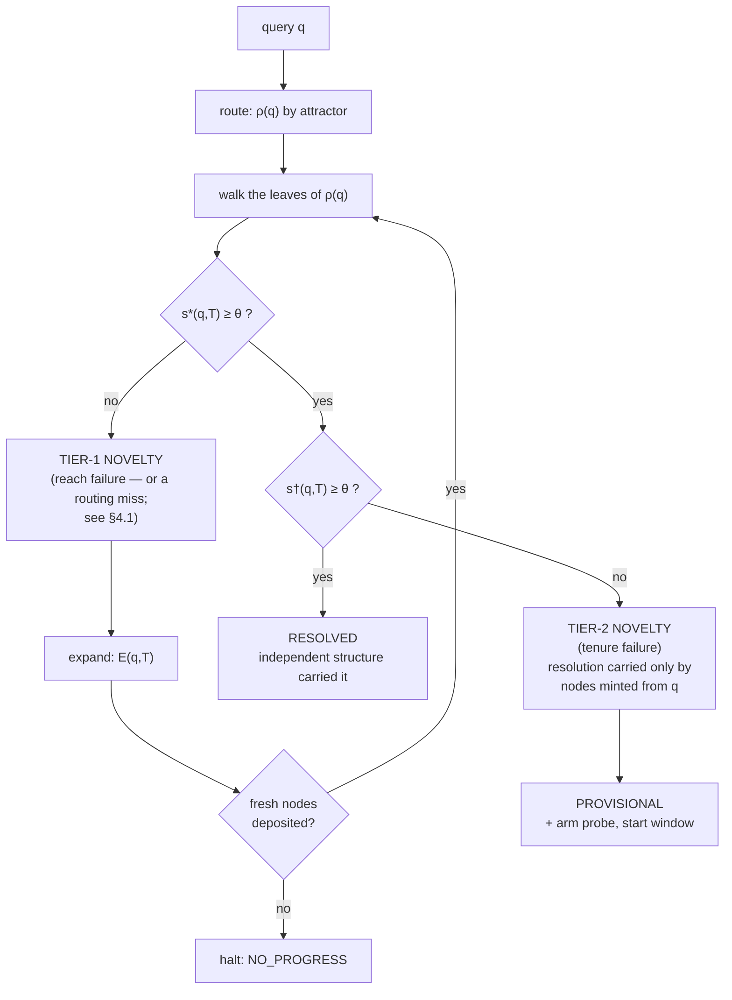
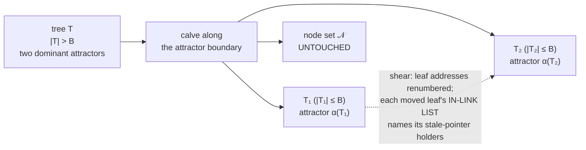

# Novelty-driven graph tree expansion

### Two tiers of novelty, and a defense against self-confirming retrieval

**Draft paper.** Author: Akien MacIain · Status: draft, awaiting signature gate ·
Date: 2026-08-05, revised 2026-08-20 · Target venues: AAAI, CogSci, NeurIPS/ICLR
workshop tracks, AGI

*Revision of 2026-08-11:* §4.2's tenure mechanism moved from designed to built
(2026-08-09) and carries a measured status note; the corroboration defect it
predicted is fixed; falsifier 3 is marked survived at $n = 88$ and kept on the
list, with its inverse named.

*Revision of 2026-08-20:* Four structural features moved from designed to built
and proved: attractors (§6.4), calving (§6.4), bidirectional weighted links (§6.2),
and multi-tree routing (§3.1). The three-table schema (nodes / embeddings / leaves)
is the running store. Tenure measured at $n = 1{,}770$: 11 earned, 26 refuted. §10
added: cross-domain structural embeddings as future work, connecting `render_method`
to Gentner's structure-mapping theory. All figures trace to
`press_office/FactSheet.md`.

---

> **What kind of paper this is.** An *architecture and protocol* paper, not a
> results paper. The mechanism is implemented and has been run; the measurements
> are n=1 and are labeled as such throughout. §7 states the evaluation protocol
> that would turn the central claim into a result, and §8 states what would refute
> it. The strongest empirical content in the paper is a **negative** result about
> our own design (§5), and it is the reason the mechanism in §4 exists.

---

## Abstract

Retrieval systems built over embeddings answer well inside their coverage and fail
outside it. A natural response is to let the system extend itself: on a retrieval
miss, ask a language model to supply new material, deposit it, and retry. We
implemented this and measured a failure mode that we believe is general to the
design. Nodes generated during expansion are conditioned on the query that
triggered the expansion, so they are *question-shaped* and win the similarity
contest for that query by construction. In a measured crossing, a query whose
target knowledge was entirely absent from the walked graph was "resolved" at
cosine 0.8295 against three freshly minted nodes whose content was wrong. The
system had not failed loudly; it had **manufactured resolution**.

We give a formal criterion that separates this case from genuine resolution, using
the *mint relation* between a node and the query it was generated from. This yields
a **two-tier novelty model**: tier-1 novelty is a reach failure (nothing in the
graph is near the query); tier-2 novelty is a **tenure failure** (something is near
the query, but only things the query itself produced). Tier-1 is answered by
structural expansion; tier-2 is answered by **probes and time** — a node must earn
residence by resolving questions it was not minted from, within a window, or
expire.

We describe the expansion operator, the admission constraints that make an
expanding graph auditable rather than merely growing, and the storage design that
keeps traversal viable at scale: a separation of *nodes* (what is remembered),
*embeddings* (renderings of a node as coordinates, many per node) and *leaves*
(how it is found), per-tree leaf tables, addressed leaves carrying bounded
weighted similarity links and two-way articulated links, and attractor-directed
calving. That
separation is not incidental to the novelty mechanism — it is what guarantees that
reorganizing the index cannot perturb the provenance the mechanism adjudicates on. We give a worked example, an evaluation
protocol with ablations, and the falsifiers we hold ourselves to. Applying the
tier-2 criterion retrospectively reclassifies at least one of our own reported
successes as provisional, which we take as evidence the criterion is doing work.

---

## 1. The problem

Structured inference systems that retrieve before they generate share a boundary
condition: **what happens at the edge of coverage.** Three standard answers, each
with a known cost.

1. **Fail.** Return nothing, or return the nearest thing with a low confidence
   score. Honest, and the coverage never improves.
2. **Generate.** Fall through to the language model and answer from parameters.
   This is what most retrieval-augmented systems do. The generation is rendered and
   discarded; the next identical query costs the same as the first; the retrieval
   layer's competence is constant over the system's life.
3. **Extend.** Use the model to add to the retrieval substrate, then retry.

Option 3 is the interesting one, and it is what we built. It has an obvious appeal:
it converts the expensive resource (the model) into a durable asset (structure), so
that the resolver is spent on novelty rather than on re-deriving what the system
has already been told. It also has a non-obvious hazard, which is this paper's
subject.

**The hazard.** If the model is asked to supply material *for a specific query*,
the material it supplies is conditioned on that query. Under any similarity metric
over embeddings, material generated from a query is close to that query — not
because it is correct, but because it is a paraphrase of the question's own
semantic neighborhood. The retry therefore succeeds *by construction*, and the
success carries no information about whether the system now knows anything.

A self-extending retrieval system, naively built, is a machine for **converting
ignorance into confident answers**. It does not fail loudly. It reports a high
similarity score, cites the nodes it just minted, and looks exactly like a system
that learned something.

We measured this happening (§5). This paper is the response.

---

## 2. Related work, and what this composes

**Cognitive architectures.** SOAR's *impasse → subgoal → chunking* loop [Laird] is
the nearest structural relative: when no operator applies, the architecture
subgoals, and the resolution is chunked into a rule so the impasse does not recur.
ACT-R's activation and utility equations [Anderson, Lebiere] are the nearest
relative to our tenure mechanism, and we expect to borrow rather than invent there.
Sigma [Rosenbloom] and OpenCog occupy the same neighborhood.

The distinguishing fact is not the loop; it is the **provenance of the chunk**.
SOAR chunks the result of its own valid problem-solving. We chunk the output of an
external model conditioned on the query. That difference is exactly the hazard in
§1 — chunking has no analogous failure mode, and therefore no analogous defense,
which is why tenure is not simply utility decay borrowed wholesale.

**Novelty and out-of-distribution detection** [MIT CSAIL; Stanford; Toronto;
DeepMind] provides calibrated detectors far better than the single cosine threshold
we use. That field detects novelty and stops; it does not grow structure from the
detection. Our tier-1 detector should be replaced with theirs.

**Neuro-symbolic reasoning** [IBM; MIT concept-bottleneck models; DeepMind] shares
the vector/symbol hybrid and the commitment to inspectable units. It does not
supply question-driven expansion or admission control.

**Dynamic graph learning** [Stanford Graph Learning Lab; CMU] supplies machinery for
modifying graph structure during learning, without deterministic question operators
governing the modification.

**Program synthesis and pipeline compilation** [PROSE; DSPy-shaped compilation] is
the nearest relative to our stratum-migration claim (§9.6). The contrast is sharp
and worth stating as the central bet: **that line distills model-to-model; we
distill model-to-structure, and then structure-to-code.**

**Factored cognition** [Ought / Elicit] is the prior art for claim decomposition
with evidence.

**Industrial neighbors.** GraphRAG-style systems build a graph to assemble better
*context for* generation; the arrow points the other way here — the graph is the
answerer and the model is the graph's gardener. Semantic answer caches store an
*answer* keyed by an embedded query; we store the *structure that produces
answers*, which composes across queries in a way a cached answer does not.

**What we claim is composed rather than invented:** question-driven expansion
(cognitive architectures) + admission control on graph growth (databases, and our
own provenance discipline) + a tenure criterion defined against the mint relation
(new, as far as we can tell) + judgment migrating down a stratum ladder (program
synthesis / compilation). We have not found the composition assembled elsewhere.
That is a statement about our search, and our search has been shallow; §7 includes
a literature pass as owed work.

---

## 3. Architecture

### 3.1 Definitions

The architecture separates **what is remembered** from **how it is found**, and
the separation is load-bearing enough to appear in the notation.

A **node** is the unit of memory:

$$n = \langle c_n,\; \pi_n,\; \sigma_n \rangle$$

where $c_n$ is one claim in natural language, $\pi_n$ its provenance record, and
$\sigma_n \in \{\textsf{hypothesis},\textsf{earned}\}$ its standing. Every node is
born `hypothesis`. Nodes live in a single per-database set $\mathcal{N}$ and
**belong to no tree**.

An **embedding** is one rendering of a node as coordinates:

$$e = \langle \nu(e) \in \mathcal{N},\; v_e \in \mathbb{R}^d \rangle$$

Embeddings are **many per node** and point back to it as it points to them: one
claim may be rendered raw, as prose, or under any other transform, and each
rendering is separately findable. §5 reports a measured case where this matters —
a diagram-shaped passage scoring below less relevant prose, where one vector per
node would force a choice of rendering and several do not. An embedding is
**derived**: it is recoverable from its node, and holds no record of truth.

A **leaf** is the unit of indexing:

$$\ell = \langle a_\ell,\; e_\ell,\; \Lambda_\ell,\; E_\ell \rangle$$

where $a_\ell$ is its **address** `database.tree.leaf`, $e_\ell$ the embedding it
indexes (write $v_\ell$ for that embedding's vector and $\nu(\ell)$ for its node),
$\Lambda_\ell$ its bounded weighted similarity links (§6.2), and $E_\ell$ its articulated
edges to other leaves. A **tree** $T$ is a set of leaves. The map $\nu$ is
many-to-one: one node may be indexed by many leaves across many trees, which is
what allows two tree sets over one node set. Placing the vector in its own layer
rather than on the node is what makes those placements independent — a node-side
vector would place a node identically in every tree that indexed it.

Address and identity are distinct throughout. $a_\ell$ is a **locator** and changes
under reorganization (§6.4); node identity does not.

For a query $q$ with embedding $v_q$, write

$$s(q,\ell) = \cos(v_q, v_\ell), \qquad s^*(q,T) = \max_{\ell \in T} s(q,\ell).$$

**Resolution** is $s^*(q,T) \ge \theta$ for a floor $\theta$.

Since a corpus is partitioned across many trees, a walk is preceded by a **routing
function** $\rho(q) \subseteq \{T_1,\dots,T_M\}$ selecting which trees to walk,
by proximity to each tree's **dominant attractor** $\alpha(T)$ — the centroid of
its leaves. This is the sense in which the vector *is* the path: no route is
stored as a route; $v_q$ run against $\{\alpha(T)\}$ *generates* the choice of
trees. Within a tree the traversal follows the weighted similarity links of §6.2,
falling back to comparison against $\{v_\ell\}$ where those come up short — the
weights being what allow the traversal itself, and not merely its contents, to
improve with use. §4.1 notes what $\rho$ does to novelty detection, and it is not
benign.

The **mint relation** $\mu$ is the piece that does the work in this paper. For a
node created during an expansion triggered by query $q$, $\mu(n) = q$; for a node
that arrived any other way (read from a document, deposited from a trace),
$\mu(n) = \bot$. The mint relation is recorded in $\pi_n$ at deposit time and is
not reconstructible afterwards — which is why provenance has to be an admission
requirement rather than a nice-to-have. Leaves inherit it: $\mu(\ell) \equiv
\mu(\nu(\ell))$. Note that minting is a property of the *remembered thing*, not of
any index over it — so a node's mint provenance survives every reorganization of
every tree that indexes it, which is what makes the criterion below durable.

Define the **independence-corrected score**

$$s^{\dagger}(q,T) = \max_{\{\ell \in T \;:\; \mu(\ell) \neq q\}} s(q,\ell).$$

$s^\dagger$ asks: *setting aside everything this very question caused to exist, how
close does the graph get?*

### 3.2 The expansion operator

Let $R$ be a resolver (a language model) and $G$ the deposit gate (§4.3). Expansion
is

$$\mathcal{E}(q, T) \;=\; T \cup G\big(R(q,\; \mathrm{digest}(T),\; K)\big)$$

where $K$ is the material the walk already returned and $\mathrm{digest}(T)$ is a
pure function of $T$'s membership.

Three properties are required, and each corresponds to a failure we hit:

**(P1) The resolver is asked for nodes, not for an answer.** $R$'s output is
candidate claims. The answer is produced by re-walking. A system that returns the
model's prose on a miss cannot demonstrate that expansion accomplished anything,
because the answer would have been identical had the deposit silently failed.

**(P2) The request carries $\mathrm{digest}(T)$.** Model calls are cached by
canonicalized request. Without the digest in the key, round two of an expansion
loop retrieves round one's cached response, deposits nothing new, and the loop
runs forever. *Same question + changed graph = different key* is a physical
property of the cache key, not a retry policy.

**(P3) No-progress terminates loudly.** If $|G(\Delta N) \setminus T| = 0$, the
loop halts with a named verdict. Silence and retry are both wrong.

### 3.3 The control loop



Note what the second test does to the verdict space. A system with one threshold
has two outcomes. This one has **three**:

| verdict | condition | meaning |
|---|---|---|
| `RESOLVED` | $s^\dagger \ge \theta$ | independent structure answered |
| `PROVISIONAL` | $s^* \ge \theta > s^\dagger$ | answered only by what the question minted |
| `UNRESOLVED` | $s^* < \theta$ after expansion budget | honest miss |

`PROVISIONAL` is the contribution. It is the state a naive implementation reports
as success.

---

## 4. The novelty mechanism

### 4.1 Tier 1 — reach failure

$s^*(q,T) < \theta$: nothing in the graph is near the query. This is ordinary
out-of-distribution detection over the node embeddings, and our detector — a single
fixed cosine floor, $\theta = 0.65$, seeded by exactly one observation — is
deliberately the crudest instrument that works. The response is structural
expansion (§3.2).

We flag this as the component most obviously improvable by borrowing: the OOD
literature has calibrated, uncertainty-propagating detectors, and swapping ours for
one of theirs changes nothing else in the architecture.

**A qualification on tier 1 that no better detector fixes.** Because a walk is
preceded by routing (§3.1), $s^*(q,T)$ is conditioned on $\rho(q)$. If $\rho$
selects the wrong trees, $s^*$ is low for a reason that has nothing to do with
coverage — and tier-1 detection fires anyway. **A routing error is therefore
indistinguishable from genuine novelty**, and the system expands into material it
already holds, depositing question-shaped nodes in the neighborhood the router
already prefers.

This is the exact mirror of §5's finding, and we name it as such: manufactured
*resolution* is a high score that is not evidence; **manufactured novelty** is a
miss that is not absence. The second is the more dangerous, because it is
self-reinforcing — each routing error deposits material that makes the mistaken
tree marginally more attractive to the next similar query, while the material that
would have answered correctly sits unvisited in a tree the router never selects.

Two responses, neither expensive:

- **Probe $|\rho(q)| = k > 1$.** At $d = 768$ and $B = 5{,}000$, $k=5$ raises the
  bytes touched per query from ~15 MB to ~75 MB — negligible against the 7.7 GB a
  flat walk would touch (§6.3).
- **Measure router recall@$k$** as a first-class quantity (E7, §7): the fraction of
  queries whose known-correct leaf lies in a tree $\rho$ actually selected. A
  self-extending system needs this number before it can interpret its own miss
  rate at all — an uncorrected tier-1 rate is partly a measurement of the router.

We state this as a prediction of the architecture, **not as an observation**; our
current measurements are single-tree and do not exercise $\rho$.

### 4.2 Tier 2 — tenure failure, and the proto-node

$s^*(q,T) \ge \theta$ but $s^\dagger(q,T) < \theta$. The graph appears to answer;
the appearance is manufactured.

The response is **not** to discard the minted nodes. They may be correct, and
discarding them throws away the expansion. The response is to **change what their
presence entitles them to**:

- The nodes are deposited as **proto-nodes** — $\sigma = \textsf{hypothesis}$, which
  is the birth standing of everything, plus a recorded $\mu(n) = q$.
- The verdict returned is `PROVISIONAL`, and it names its own basis.
- A **probe** is armed and a **window** opens. This is the "time in which to learn
  more."

**Promotion.** Define the witness set of a node:

$$W(n) = \{\,q' \;:\; q' \neq \mu(n),\; n \text{ carried the resolution of } q',\; \text{and that resolution was accepted}\,\}$$

Promotion to $\sigma = \textsf{earned}$ requires $|W(n)| \ge m$ within the window.
The node must resolve questions **it was not minted from**. Failing that, it
expires.

This is the whole defense, and it is one sentence: **a node earns residence by
being useful to a question that did not create it.**

**Guardrails on the promotion rule**, carried over from our gate-learning
discipline and non-negotiable:

- **Asymmetric.** Counter-evidence demotes faster than confirmation promotes.
- **Ceilinged.** Some classes never auto-promote, however much evidence
  accumulates — irreversible and outward-facing consequences are structurally
  excluded from automatic trust, as a typed field rather than a comment.
- **Silence is not approval.** Absence of a contradiction is weak evidence at most.

**Corroboration.** A duplicate deposit from an *independent* source is exactly the
evidence tenure wants — a second witness to the same claim. Our implementation used
to drop the duplicate's provenance, discarding that evidence; it was noted here
because it is the kind of defect that hides behind a passing test. **Corrected
2026-08-09, as predicted:** a duplicate still writes no new row and now reports
`provenance_appended`, landing the incoming provenance as an attestation on the
standing row.

**Implementation status of §4.2.** Built and proved 2026-08-09; measured 2026-08-20
over a multi-tree store of 1,770 nodes across 8 leaf tables: 1,733
$\textsf{hypothesis}$, 11 $\textsf{earned}$, 26 $\textsf{refuted}$. Four properties
are enforced rather than described — a node cannot tenure on an echo of its own
$\mu(n)$; promotion requires $m = 2$ distinct cross-questions; a refuter may retire
an $\textsf{earned}$ node only if it has earned tenure itself **or** its provenance
names it an authority — the second arm exists so that a stated correction from
outside the system can always outrank the corpus, which a standing-only gate would
forbid; and decay is evaluated **lazily on read** against a 14-day horizon, with
only a *cross*-question attestation exempting a node, so no sweeper process exists.
The numbers are an existence proof of the mechanism at growing scale, **not**
evidence about the promotion rule's calibration. Nothing in §7's protocol is
discharged by them. Notably, the earned fraction (0.6%) remains low — the inverse
of falsifier 3 (§8) — consistent with the criterion measuring correctness rather
than popularity.

### 4.3 The constraint layer: what may join the graph

An expanding graph without admission control is a growing graph, not a learning
one. Five constraints gate every deposit, from every source, with no privileged
writer:

1. **Provenance.** A node whose source cannot be named is refused. Not logged and
   accepted — refused. The asymmetry justifies the strictness: a fabricated
   attribution in a rendered answer is transient; in a node it is a permanent
   resident that every future walk may ground on.
2. **Content floor.** Below a minimum length, refused. A claim distilled from
   near-nothing is invention wearing a vector.
3. **Dimension.** The first deposit fixes a tree's dimension. A mismatched deposit
   *or query* is refused loudly. Answering a 4-dimensional query against a
   768-dimensional tree returns a confident wrong answer, which is the worst
   available outcome.
4. **Identity and idempotence.** $\mathrm{id}(n) = \mathrm{hash}(\mathrm{norm}(c_n))$,
   per database. Content-addressed and **tree-free**: the same claim is the same
   node however many leaves index it, and a duplicate writes nothing. Binding
   identity to a tree would make every reorganization a re-identification pass over
   the corpus, which is precisely the conflation §3.1 separates.
5. **Ownership.** Exactly one owner per store; the owner gates every write; an
   ownerless store cannot be created. Enforced as a schema constraint and a single
   connection-holding module, not as a convention.

Two further constraints govern *derived* artifacts:

- **Citations are code-built.** When the system renders prose over a graph region,
  the model may only place marks; the bibliography is assembled from what the walk
  actually returned. A citation naming a node the region never held is refused with
  the raw output carried whole. A model that can mint its own citations can
  manufacture provenance, which defeats constraint 1 one level up.
- **Addresses do not rot.** Source material is frozen with a registered digest at a
  stable address. Different content arriving at a standing address is refused,
  because provenance anchors point into those addresses.

We regard this layer as an equal contribution to the novelty mechanism. **Expansion
without admission control produces a graph that cannot be audited, and a graph that
cannot be audited cannot be trusted with the answer.** Each constraint above is a
**hard gate** — a door that refuses, deterministically, with no override path and no
model in the loop. The architectural principle is stated in full in the companion
pattern document (see `PatternGatesAndInspectors.md`, §2.1): *every rule that
matters is a door that refuses.* A rule enforced by policy degrades with context
length, model version, and the hour; a rule enforced by a `raise` does not.

---

## 5. Worked example — the measured failure

**Setting.** A conversational face over a graph tree built from a shelved document
collection (34 nodes at the time of the crossing: shelved passages plus material
minted during the session). A separate tree in the same system contained the
relevant knowledge; the walk did not cross trees.

**The query** asked about a specific internal mechanism whose description lived in
the *other* tree. The walked tree contained nothing about it — this is
ground truth, established by inspection of the tree's membership, not inferred from
the score.

**What happened.**

| step | observation |
|---|---|
| initial walk | $s^*(q,T) < \theta$ — correct tier-1 detection |
| expansion | resolver produced three plausible, mechanism-shaped claims |
| deposit | all three admitted (traceable: `source: llm-backfill`, `standing: hypothesis`) |
| re-walk | $s^*(q,T') = 0.8295$ — comfortably above $\theta = 0.65$ |
| verdict returned | `RESOLVED` |
| **content of the three nodes** | **wrong** |

**Why the score was high and meant nothing.** All three nodes had $\mu(n) = q$.
They were generated *from* the query, so their embeddings sit in the query's
semantic neighborhood by construction. Computing $s^\dagger$ — the best score over
nodes not minted from $q$ — gives a value below the floor, because the tree
genuinely held nothing on the topic. The correct classification is therefore
**tier-2 novelty**, and the correct verdict is `PROVISIONAL`.

**A second measurement, same day, independent.** On a follow-up question, three
labels minted during that crossing outranked both a landed summary (4th, 0.5960)
and *every* real shelved passage. So the effect is not an artifact of an empty
tree — minted nodes outrank genuine material even when genuine material is present.

**What was honest anyway, and what wasn't.** Every node remained fully traceable,
so an auditor reading the provenance could see exactly what had happened. The
system did not lie about its sources. But **a consumer reading only the verdict line
would have called that answered** — and verdict lines are what consumers read. An
audit trail that requires a human to notice is not a defense.

**Applied retrospectively.** The criterion reclassifies our own headline result. In
our first successful expansion crossing — a query the tree could not ground, one
node deposited, the original question then resolving at 0.8568 — the resolving node
was itself the mint. Under §3.3 that crossing is `PROVISIONAL`, not `RESOLVED`.
We take the fact that the criterion demotes our best-looking number as evidence that
it is measuring something.

**Third consequence: cross-tree resolution is a requirement.** In the worked
example, the system possessed the knowledge and never looked. Expansion should be
the *last* resort, after the other trees; minting before searching is how a
multi-tree system talks itself into an answer it already had. This is unbuilt.

Note that this crossing is also, read from the other side, an instance of the
routing failure in §4.1 — the correct material existed and $\rho$ did not select
it. Here $\rho$ was trivial (a single tree, chosen by the caller), so we cannot
attribute the miss to a *learned* router. But it is the same shape, and it is why
E7 conditions the interpretation of E2 rather than sitting beside it.

---

## 6. Storage: making a link structure survive scale

The mechanism above assumes a graph you can walk cheaply. That assumption has to be
paid for.

### 6.1 The load problem this design answers

The design is not a thought experiment; it is a response to a measured failure. A
conventional build of the same idea — conventional tables, a **stored edge
table** — reached 70,000 words and $2.5 \times 10^6$ bigram edges, at which point
**every edge update took over 30 seconds**.

The mechanism is unremarkable and that is the point: ingesting one memory issues
many updates against a multi-million-row edge table, each an index seek or scan,
each taking a write lock, each syncing — and **the cost grows with the corpus.**
The system slowed down exactly as it learned more. A different engine buys perhaps
an order of magnitude before meeting the same wall, because the wall is not the
engine.

The wall is worth naming precisely: **a link structure with no bound on degree**,
so that the work of one ingest rises with everything already learned. It is not
"storing links at all," and the difference decides §6.2. A structure capped at $k$
links per leaf exhibits none of the mechanism above, because $k$ is a constant and
a constant does not care how much the system has learned.

The resulting trade is the whole of §6:

| | write cost | read cost |
|---|---|---|
| unbounded edges | **grows with the corpus** | cheap |
| bounded edges + bounded trees | **constant in corpus size** | bounded by $B$, not by $N$ |

Depositing a memory writes one node row, one embedding row, one leaf row, and a
neighbor list of $k$ entries — $k$ chosen, where the predecessor wrote a list that
grew with everything it had ever learned. The price moves from write time to read
time, where a bound can cap it. This also fixes the scale at which the design must
be evaluated: $2.5 \times 10^6$ is not a projection, it is the size at which the
predecessor died.

### 6.2 Similarity edges are stored — bounded and weighted

Each leaf keeps a short neighbor list, $k$ entries and not $n$, each entry
carrying a **weight** that moves with use: links whose paths resolve get stronger.

This supersedes an earlier ruling that similarity edges were derived at walk time
and never stored, which rested on **single-record integrity** — a stored
similarity table being a second record of a truth the vectors already contain, and
two records of one truth drifting apart. That argument is sound *about an
unweighted table*, which is recomputable from the vectors and therefore risks
drift while buying nothing. It does not reach a weighted one. A weight is not
recomputable from any vector: it records what actually resolved, which is new
information and a first record rather than a second. It is also the only place the
index's own learning can live — without it the corpus grows while the retrieval
mechanism stays exactly as good, and exactly as expensive, at query $10^6$ as at
query 1.

Because weights are stored state that must survive a renumbering, similarity edges
now ride the same shear as articulated ones (§6.4). What still distinguishes the
two is authorship, not cost: an articulated edge is asserted and is wrong if it
misstates its author; a similarity edge is learned and is wrong only if it stops
predicting.

*Status (updated 2026-08-20):* built and proved. The `cairn_links` table stores
bounded, weighted, bidirectional links. Four operations are implemented:
`link` (create or update), `linked` (read from either end), `traverse_link`
(increment traversal count), and `link_neighbors` (create $k$ links from a node to
its nearest neighbors by cosine). Link identity is deterministic and
direction-independent: $\mathrm{id}(a,b) = \mathrm{id}(b,a)$, so the mirror
invariant of §6.4 holds by construction. Six proof teeth cover creation, update,
bidirectional read, traversal counting, and neighbor linking. The running `nearest`
and `neighbors` still compute proximity by exhaustive cosine at walk time; the links
are the learned layer that allows traversal to improve with use.

### 6.3 Which makes a bound mandatory

The binding constraint is not arithmetic but working-set size. At $d = 768$,
float32, $N = 2.5\times10^6$ leaves and $B = 5{,}000$ (so $M \approx 500$ trees),
the bytes a single query must touch:

| | bytes |
|---|---|
| flat, over every leaf | $N d \cdot 4$ = **7.7 GB** |
| attractors $\{\alpha(T)\}$ | $M d \cdot 4$ = 1.5 MB |
| the leaves of one tree | $B d \cdot 4$ = 15 MB |
| **routed total** | **≈ 16.5 MB** |

The ratio is ~470×, but the operative fact is categorical rather than
proportional: 7.7 GB per query fits in no cache and streams from main memory,
while 16.5 MB stays resident. So the design that bounds the edge structure is the
design that requires bounded trees. **These are one decision, not two.**

Note also that $M$ scales as $N/B$, so flat routing over attractors remains cheap
far past the scale in question: a tree-of-trees is not indicated until $M \sim
10^5$, i.e. $N \sim 5\times10^8$ leaves.

### 6.4 Calving builds the path; the shear repairs the index

- **One node list per database; each tree is its own physical table of leaves.**
  Two tree sets index one node set — the same claims organized along different
  axes, without duplicating the claims.
- **A leaf address is `database.tree.leaf`.** The address carries its table, so
  reaching a leaf is *addressing*, not searching: constant time and constant
  *variance* as the graph grows. The usual objection to per-tree tables — that
  cross-tree edges become expensive — assumes edges must be searched for. A
  cross-tree link here is a leaf address with a different table part.
- **Calving is generative, not merely custodial.** A tree past its bound splits
  along its **dominant attractors**, and each calve *mints an attractor* — which is
  the object $\rho$ steers by. Before the first calve a tree is flat and there is
  no route to walk, only a scan. The cost bound of §6.3 is a consequence of
  building routable structure, not the purpose of building it.
- **The shear renumbers leaf addresses**, and articulated edges are **two-way** so
  that it can.



**Why two-way is the load-bearing part.** A moved leaf leaves stale pointers
behind; the question is how their holders are found. Because each articulated edge
is mirrored, a moved leaf's in-link list *is* that set — the affected leaves are
not merely few, they are **addressable**. One-way, the set exists with no address
and is recovered by scanning every leaf's out-links: the search this design exists
to eliminate, reappearing in the reverse direction. With bound $B$ and corpus $N$,
growth to $N$ costs $\sim N/B$ calves:

| | per calve | cumulative to $N$ |
|---|---|---|
| one-way | $O(N)$ scan | $O(N^2 g / B)$ |
| two-way | $O(B\,g)$ | $O(N g)$ |

Quadratic versus linear in corpus size — and the quadratic form becomes expensive
precisely as the corpus grows large enough to require calving.

**A property we regard as a contribution in its own right: a calve never touches a
node.** Reorganization is confined to the leaf layer, so $\pi_n$ and $\sigma_n$ —
provenance and standing, the audit substrate the whole novelty mechanism rests on —
cannot be perturbed by index maintenance. Records of truth and the structures that
locate them are modified by disjoint operations.

The embedding layer sharpens this rather than qualifying it. A calve may have to
touch an embedding's back-references; that is admissible precisely because an
embedding is derived and can be regenerated from its node, where a node can be
regenerated from nothing. The deepest layer reorganization can reach is therefore
the layer that is cheap to rebuild.

**Correctness condition on the mirror.** If a link's two halves can be written
independently they can drift, and a drifted in-link means a shear misses a leaf —
whose stale pointer then does not dangle but *silently retargets* to whatever
subsequently occupies that address. Both halves must therefore be written by one
operation or the link must not exist; the falsifier is the existence of an out-link
without its mirror. Monotonic leaf-number allocation (never reusing a number after
a shear) converts any residual miss from a silent retarget into a loud dangle.

**Status and burden of proof (updated 2026-08-20).** The running store is the
three-table form: `cairn_nodes` (shared), `cairn_embeddings` (many per node via
`render_method`), per-tree leaf tables. At time of writing: 1,770 nodes, 1,779
embeddings, 8 leaf tables across two devices. Calving is built and proved: 2-means
clustering along the dominant attractor boundary, splitting a tree above threshold
$B$ (default 5,000) into `{table}_0` and `{table}_1`, emptying the parent. Three
proof teeth cover below-threshold (returns None), correct splitting (union covers
parent, intersection empty, parent emptied), and distinct attractors on children.
Multi-tree routing is built: `route(q)` ranks tables by cosine to each tree's
attractor, skipping empty trees. Three proof teeth cover ranking, empty-tree
skipping, and the $k$ bound.

Open and named as open: the bound (provisionally 5,000 leaves, moved from 1,000 in
an earlier generation, which is evidence it is a parameter to learn rather than a
constant to fix); the rate at which a similarity weight falls, since a weight that
only rises on resolution is a positive feedback loop and requires counter-evidence
to lower it faster than confirmation raises it — a constant we have not measured;
whether a node carries back-references to its leaves, which decides whether the
never-touches-a-node property survives; and the fact that cross-tree in-links are
**cross-owner writes**, so under one-owner-per-store a shear's fixup must travel
through the other owner's gate. Two-way links make that tractable — the shear knows
exactly whom to notify — but not free. **The design must be measured at the scale
it was designed for, $\sim 2.5 \times 10^6$ nodes, and the test is two-sided
because the baseline in §6.1 is two-sided: access time must not degrade with graph
size, and write cost must not grow with corpus size. Demonstrating the shape on
$\sim 1{,}800$ rows does not count.**

---

## 7. Evaluation protocol

None of the following has been run. This section exists so that the claims above
are falsifiable rather than merely stated, and so that a reader can hold us to a
specific measurement.

**Corpus and queries.** A held-out question set over a document collection the
system has read, plus a second set over material it has *not* read (to exercise
tier-2 deliberately). Our current measurements use our own design documents, which
is self-referential and a real threat to validity.

**E1 — Hit-rate trajectory.** $h_t$ over a stationary query stream. *Claim:*
non-decreasing, rising fast on the head of the distribution. *Refuted by:* flat
$h_t$.

**E2 — Manufactured-resolution rate (headline).** The fraction of resolutions where
$s^* \ge \theta > s^\dagger$. *Claim:* substantial without the tier-2 test, and
correctly reclassified with it. This is the metric the paper turns on.

**E3 — Tenure survival.** The fraction of proto-nodes that reach $|W(n)| \ge m$
within the window, and the accuracy of survivors versus expirees under human
adjudication. *Claim:* survivors are more accurate than expirees. *Refuted by:* no
separation — which would mean tenure is measuring popularity, not correctness.

**E4 — Migration rate.** The distribution of decisions across strata (model /
graph / code) over time. *Claim:* it moves downward. *Refuted by:* a flat
distribution.

**E5 — Scale, two-sided.** Access time and walk latency versus graph size out to
$2.5 \times 10^6$ nodes, with and without calving — *and* per-deposit write cost
versus corpus size over the same range. The predecessor failed on the second axis
(§6.1), so measuring only the first would miss the failure the design exists to
avoid.

**E6 — Vacuity.** Refusal rates at every gate. A door that never refuses is
vacuous; one that always refuses is mis-gated. Both are defects, and neither is
visible without the counts.

**E7 — Router recall@$k$.** The fraction of queries whose known-correct leaf lies
in a tree $\rho(q)$ actually selected, as a function of $k$. *Claim:* recall is
high enough at small $k$ that tier-1 misses reflect coverage rather than routing.
*Refuted by:* low recall — under which the tier-1 rate is partly a measurement of
$\rho$, §4.1's manufactured novelty is live, and E2's denominator is contaminated.
This should be run **before** E1 or E2 are interpreted, because it conditions both.

**E8 — Does composition earn the walk?** The architecture holds that a walk
*produces* a representation, not merely retrieves with one: a text's stored vector
is composed from the leaves its seed vector walked to. *Claim:* the composed vector
outperforms the seed vector at retrieving known-correct nodes. *Refuted by:* no
separation — under which the trees remain a defensible cache but "the vector
becomes the path" is not doing work, and §6's structure is justified only by cost.
This is the cheapest experiment in the list and the one whose negative result would
be most informative.

*Validity condition, and it is not optional:* **compose over the weighted route,
not over a cosine ranking.** Averaging leaves that were selected *for* proximity to
the seed returns a vector near the seed close to tautologically, so run against the
present unweighted implementation the experiment is confirmatory by construction
and measures nothing. The weights of §6.2 are what supply something learned to
compose over; until they exist, E8 is not runnable in a form that could refute
anything.

**Ablations.** (a) No deposit — plain retrieval-augmented generation. (b) Semantic
answer cache. (c) Deposit without tenure — the naive self-extending system, which
we expect to show high E2. (d) Deposit with tenure. (e) GraphRAG-style baseline.

**Threats to validity, stated plainly.** Every current measurement is n=1. $\theta$
was set from a single observation. One embedding model and one drafting model
throughout. The corpus is the system's own documentation. There is no held-out
question set yet. And the literature survey behind §2 rests on a single secondary
source and has not been checked against primary work — a proper pass is owed
before submission.

---

## 8. What would refute this

1. **E2 comes out near zero without the tier-2 test.** Then manufactured resolution
   is not a real phenomenon at scale, the central mechanism is a solution to a
   non-problem, and the paper collapses to a storage note.
2. **Tenure survivors are no more accurate than expirees.** Then the promotion
   criterion measures something other than correctness, and $W(n)$ is the wrong
   witness definition.
3. **Every node remains `hypothesis` in live use.** Then tenure never operated,
   standing is decorative, and §4.2 is prose. *Survived twice: at $n = 88$
   (2026-08-11, 3 earned, 1 refuted) and at $n = 1{,}770$ (2026-08-20, 11 earned,
   26 refuted).* It stays on this list, because surviving at 1,770 nodes is not
   evidence about $2.5\times10^6$ — and because the inverse is the sharper failure:
   an earned fraction that climbs **fast** means $W(n)$ is measuring popularity
   rather than correctness, which is falsifier 2 arriving from the other side. At
   0.6% earned the fraction is low, which is consistent but not conclusive.
4. **Answers arrive from the model when the graph already holds the structure.**
   Then the architecture is a vector cache with additional ceremony.
5. **Access degrades with graph size at $2.5\times10^6$ nodes, or write cost grows
   with corpus size.** Either failure means the design does not beat the baseline
   that motivated it (§6.1), and §6 reopens.
6. **$h_t$ is flat on real traffic.** Then the amortization argument — the reason to
   prefer extension over generation — is wrong.
7. **Router recall@$k$ is low at usable $k$.** Then tier-1 detection is measuring
   the router as much as the corpus, manufactured novelty (§4.1) is operating, and
   the two-tier model needs a third case rather than a footnote.
8. **Composed vectors do not beat seed vectors (E8).** Then the walk is a retrieval
   step and not a representational one, and §3.1's identification of the path with
   the vector is a description of the traversal only.

---

## 9. Contributions, stated conservatively

1. **A characterization of manufactured resolution** in self-extending retrieval,
   with a measured instance, and a formal criterion ($s^*$ versus $s^\dagger$ under
   the mint relation) that separates it from genuine resolution. We believe this is
   the paper's real content, and it is a negative result about a design pattern that
   is becoming common.
2. **A two-tier novelty model** distinguishing reach failure from tenure failure,
   with distinct responses: structural expansion for the first, probes and time for
   the second.
3. **A three-valued verdict space** — `RESOLVED` / `PROVISIONAL` / `UNRESOLVED` —
   that follows directly from (1) and that a naive implementation collapses into
   two, hiding exactly the case that matters.
4. **An admission-constraint layer** that makes an expanding graph auditable:
   provenance as a gate, dimension as physics, content addressing, single
   ownership, code-built citations, and non-rotting source addresses.
5. **A storage design** in which bounded edges and bounded, attractor-calved trees
   are shown to be a single coupled decision rather than two independent ones —
   together with a **node/embedding/leaf separation** under which reorganization is
   confined to the index layer, so that the provenance and standing the novelty
   mechanism depends on cannot be perturbed by index maintenance; what maintenance
   *can* reach is the embedding layer, which is derived and therefore regenerable. The two-way articulated
   edge is what makes the shear's affected set addressable rather than merely
   small, reducing cumulative reorganization cost from quadratic to linear in
   corpus size.
6. **A stratum-migration framing** in which adjudication moves from model to graph
   to code, and the rate of that movement is the system's operational metric —
   contrasted with model-to-model distillation as the central bet (§2).
7. **An evaluation protocol and a falsifier set**, offered in place of results we do
   not yet have — including two experiments (E7, E8) that would refute load-bearing
   parts of our own architecture.

---

## 10. Future direction: cross-domain structural embeddings

The architecture described above uses one embedding per node (modulo render
variants). A direction we intend to explore: **multiple embeddings per node, each
organized around a different structural question.** The `render_method` field in
`cairn_embeddings` already supports this — today all entries are `embed:default`,
but the schema is designed for `embed:energy_flow`, `embed:constraint_topology`,
`embed:decision_points`, and similar structural lenses.

**The observation.** Cross-domain pattern matching — the insight that debugging
a person's reasoning, debugging code, and debugging a physical system all
*look the same* to an experienced practitioner — happens because the underlying
structural invariant is the same across domain boundaries. Surface similarity
(the words, the domain vocabulary) differs; **how things work** does not. An
embedding that captures structural invariants rather than surface semantics would
make cross-domain retrieval fall out of the geometry, rather than requiring the
consumer to recognize the analogy.

This connects to Gentner's **Structure-Mapping Theory** (1983), which
distinguishes attribute similarity (surface features) from relational similarity
(how entities relate). Analogies fire when relational similarity is high and
attribute similarity is low — exactly the cross-domain transfer described above.
Recent mechanistic work (Minegishi et al.) formalizes analogical reasoning in
transformers as functors: geometric alignment of relational structure in embedding
space. The `render_method` mechanism is a concrete implementation path for this
insight: different structural questions produce different vectors from the same
content, and each vector lives in a tree organized around that question. Routing
by attractor ($\rho(q)$, §3.1) then sends a query to the structurally appropriate
tree, not the topically appropriate one.

**Reading to a question as the seeding mechanism.** A curated reading list — books
on AI, cognition, psychology, programming, and the project's own history — read
through multiple structural questions simultaneously. Each question *is* a
`render_method`. The same passage produces one node, multiple embeddings, multiple
tree placements. The cross-domain matching this paper's architecture was designed
for falls out of the geometry without any explicit domain-bridging step. Web
exploration extends the same loop outward.

**What is built.** The `render_method` field, the many-per-node embedding schema,
`route()` selecting trees by structural attractor. **What is not built.** The
multi-lens embedding producer — different embedding prompts per structural
dimension — and the reading pipeline that populates trees along multiple axes
simultaneously. Both are immediate next work.

---

## Appendix A — notation

| symbol | meaning |
|---|---|
| $\mathcal{N}$ | the node set: one per database, shared by all trees |
| $n = \langle c, \pi, \sigma\rangle$ | node — *what is remembered*: content, provenance, standing. Has identity, no tree |
| $e = \langle \nu, v\rangle$ | embedding — one rendering of a node as coordinates: the node it renders, and a vector. Many per node; derived, therefore regenerable |
| $\ell = \langle a, e, \Lambda, E\rangle$ | leaf — *how it is found*: address, the embedding it indexes, bounded weighted similarity links, articulated edges |
| $T$ | a tree: a set of leaves |
| $a_\ell$ | leaf address `database.tree.leaf` — a locator, not an identity |
| $\nu(\ell)$ | the node leaf $\ell$ indexes, via its embedding; many-to-one |
| $v_\ell$ | the vector of $\ell$'s embedding |
| $\Lambda_\ell$ | $\ell$'s similarity links: at most $k$, each carrying a weight that moves with use |
| $\alpha(T)$ | tree $T$'s dominant attractor (centroid of its leaves) |
| $\rho(q)$ | the routing function: trees selected for $q$ by proximity to $\alpha$ |
| $d$ | embedding dimension |
| $\theta$ | resolution floor (currently 0.65, seeded from one observation) |
| $s(q,\ell)$ | $\cos(v_q, v_\ell)$ |
| $s^*(q,T)$ | best similarity over the walked leaves |
| $\mu(n)$ | the mint relation: the query $n$ was generated from, or $\bot$; $\mu(\ell)\equiv\mu(\nu(\ell))$ |
| $s^\dagger(q,T)$ | best similarity over leaves with $\mu(\ell) \neq q$ |
| $W(n)$ | witness set: distinct accepted resolutions $n$ carried, excluding $\mu(n)$ |
| $m$ | tenure threshold: $|W(n)| \ge m$ promotes |
| $B$ | calving bound on tree size (leaves) |
| $M$ | number of trees, $\approx N/B$ |
| $g$ | mean articulated degree of a leaf |
| $h_t$ | hit rate at time $t$ |

## Appendix B — the loop, in full

```
resolve(q):
    v = embed(q)                                   # seed vector: enough to route
    for round in 0..max_expansions:
        trees = route(v, attractors, k_trees)      # rho(q) — probe k_trees > 1
        walk  = nearest(v, leaves_of(trees), k)    # the vector generates the path
        s_star = max(walk.similarity)
        s_dag  = max(similarity of leaves with mint(leaf) != q)

        if s_star >= theta:
            if s_dag >= theta:  return RESOLVED(walk)
            else:               arm_probe(minted_nodes, window)
                                return PROVISIONAL(walk, basis=minted)

        delta = deposit(gate(resolver(q, digest(trees), walk)))  # nodes, not an answer
        if delta is empty:  return NO_PROGRESS
                                                               # then re-walk q

    return UNRESOLVED(budget_exhausted)
```

Three lines carry the paper: the resolver is asked for `nodes, not an answer`; the
request is keyed on `digest(trees)`; and `s_dag` is computed separately from
`s_star`. Remove any one and the system becomes the failure in §5. A fourth line
carries §4.1: `route(...)` returns more than one tree, and if it did not, the
`NO_PROGRESS` and expansion branches would both be firing on the router's mistakes
as often as on the corpus's gaps.
