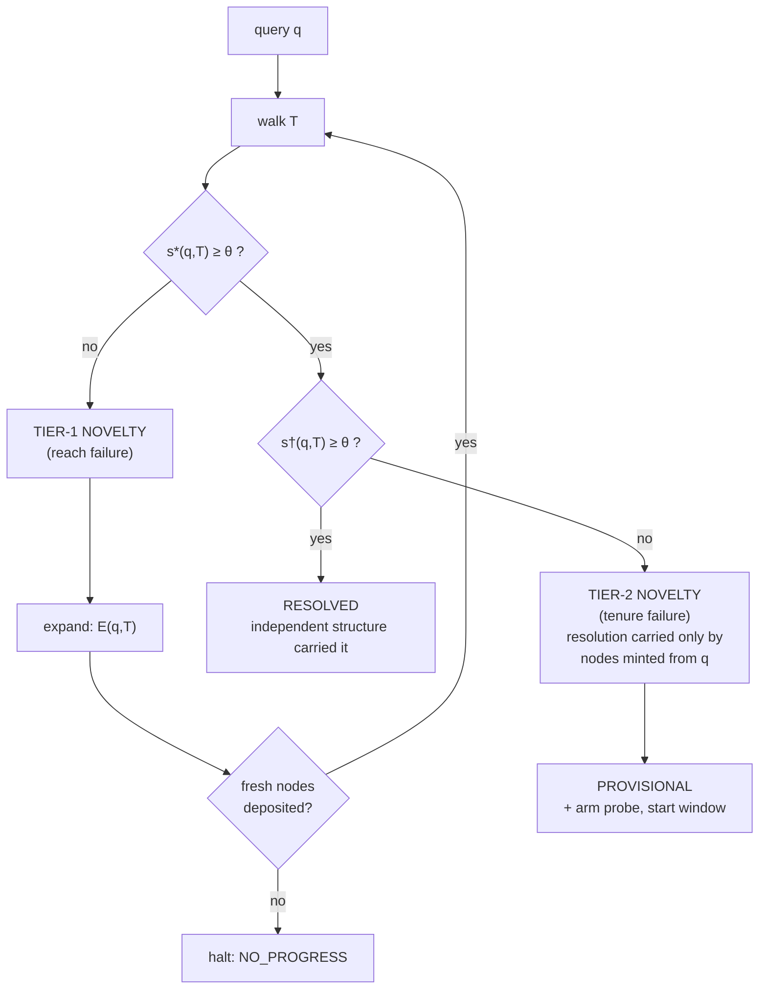
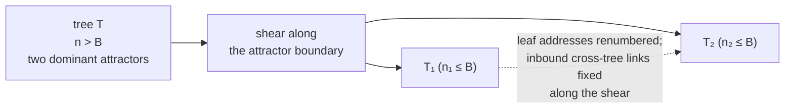

# Novelty-driven graph tree expansion

### Two tiers of novelty, and a defense against self-confirming retrieval

**Draft paper.** Author: Akien MacIain · Status: draft, awaiting signature gate ·
Date: 2026-08-05 · Target venues: AAAI, CogSci, NeurIPS/ICLR workshop tracks, AGI

---

> **What kind of paper this is.** An *architecture and protocol* paper, not a
> results paper. The mechanism is implemented and has been run; the measurements
> are n=1 and are labeled as such throughout. §7 states the evaluation protocol
> that would turn the central claim into a result, and §8 states what would refute
> it. The strongest empirical content in the paper is a **negative** result about
> our own design (§5), and it is the reason the mechanism in §4 exists.

---

## Abstract

Retrieval systems built over embeddings answer well inside their coverage and fail
outside it. A natural response is to let the system extend itself: on a retrieval
miss, ask a language model to supply new material, deposit it, and retry. We
implemented this and measured a failure mode that we believe is general to the
design. Nodes generated during expansion are conditioned on the query that
triggered the expansion, so they are *question-shaped* and win the similarity
contest for that query by construction. In a measured crossing, a query whose
target knowledge was entirely absent from the walked graph was "resolved" at
cosine 0.8295 against three freshly minted nodes whose content was wrong. The
system had not failed loudly; it had **manufactured resolution**.

We give a formal criterion that separates this case from genuine resolution, using
the *mint relation* between a node and the query it was generated from. This yields
a **two-tier novelty model**: tier-1 novelty is a reach failure (nothing in the
graph is near the query); tier-2 novelty is a **tenure failure** (something is near
the query, but only things the query itself produced). Tier-1 is answered by
structural expansion; tier-2 is answered by **probes and time** — a node must earn
residence by resolving questions it was not minted from, within a window, or
expire.

We describe the expansion operator, the admission constraints that make an
expanding graph auditable rather than merely growing, and the storage design
(per-tree tables, addressed leaves, and attractor-directed calving) that keeps
derived-edge traversal viable at scale. We give a worked example, an evaluation
protocol with ablations, and the falsifiers we hold ourselves to. Applying the
tier-2 criterion retrospectively reclassifies at least one of our own reported
successes as provisional, which we take as evidence the criterion is doing work.

---

## 1. The problem

Structured inference systems that retrieve before they generate share a boundary
condition: **what happens at the edge of coverage.** Three standard answers, each
with a known cost.

1. **Fail.** Return nothing, or return the nearest thing with a low confidence
   score. Honest, and the coverage never improves.
2. **Generate.** Fall through to the language model and answer from parameters.
   This is what most retrieval-augmented systems do. The generation is rendered and
   discarded; the next identical query costs the same as the first; the retrieval
   layer's competence is constant over the system's life.
3. **Extend.** Use the model to add to the retrieval substrate, then retry.

Option 3 is the interesting one, and it is what we built. It has an obvious appeal:
it converts the expensive resource (the model) into a durable asset (structure), so
that the resolver is spent on novelty rather than on re-deriving what the system
has already been told. It also has a non-obvious hazard, which is this paper's
subject.

**The hazard.** If the model is asked to supply material *for a specific query*,
the material it supplies is conditioned on that query. Under any similarity metric
over embeddings, material generated from a query is close to that query — not
because it is correct, but because it is a paraphrase of the question's own
semantic neighborhood. The retry therefore succeeds *by construction*, and the
success carries no information about whether the system now knows anything.

A self-extending retrieval system, naively built, is a machine for **converting
ignorance into confident answers**. It does not fail loudly. It reports a high
similarity score, cites the nodes it just minted, and looks exactly like a system
that learned something.

We measured this happening (§5). This paper is the response.

---

## 2. Related work, and what this composes

**Cognitive architectures.** SOAR's *impasse → subgoal → chunking* loop [Laird] is
the nearest structural relative: when no operator applies, the architecture
subgoals, and the resolution is chunked into a rule so the impasse does not recur.
ACT-R's activation and utility equations [Anderson, Lebiere] are the nearest
relative to our tenure mechanism, and we expect to borrow rather than invent there.
Sigma [Rosenbloom] and OpenCog occupy the same neighborhood.

The distinguishing fact is not the loop; it is the **provenance of the chunk**.
SOAR chunks the result of its own valid problem-solving. We chunk the output of an
external model conditioned on the query. That difference is exactly the hazard in
§1 — chunking has no analogous failure mode, and therefore no analogous defense,
which is why tenure is not simply utility decay borrowed wholesale.

**Novelty and out-of-distribution detection** [MIT CSAIL; Stanford; Toronto;
DeepMind] provides calibrated detectors far better than the single cosine threshold
we use. That field detects novelty and stops; it does not grow structure from the
detection. Our tier-1 detector should be replaced with theirs.

**Neuro-symbolic reasoning** [IBM; MIT concept-bottleneck models; DeepMind] shares
the vector/symbol hybrid and the commitment to inspectable units. It does not
supply question-driven expansion or admission control.

**Dynamic graph learning** [Stanford Graph Learning Lab; CMU] supplies machinery for
modifying graph structure during learning, without deterministic question operators
governing the modification.

**Program synthesis and pipeline compilation** [PROSE; DSPy-shaped compilation] is
the nearest relative to our stratum-migration claim (§6.3). The contrast is sharp
and worth stating as the central bet: **that line distills model-to-model; we
distill model-to-structure, and then structure-to-code.**

**Factored cognition** [Ought / Elicit] is the prior art for claim decomposition
with evidence.

**Industrial neighbors.** GraphRAG-style systems build a graph to assemble better
*context for* generation; the arrow points the other way here — the graph is the
answerer and the model is the graph's gardener. Semantic answer caches store an
*answer* keyed by an embedded query; we store the *structure that produces
answers*, which composes across queries in a way a cached answer does not.

**What we claim is composed rather than invented:** question-driven expansion
(cognitive architectures) + admission control on graph growth (databases, and our
own provenance discipline) + a tenure criterion defined against the mint relation
(new, as far as we can tell) + judgment migrating down a stratum ladder (program
synthesis / compilation). We have not found the composition assembled elsewhere.
That is a statement about our search, and our search has been shallow; §7 includes
a literature pass as owed work.

---

## 3. Architecture

### 3.1 Definitions

A **tree** $T$ is a set of nodes. A **node** is

$$n = \langle c_n,\; v_n \in \mathbb{R}^d,\; \pi_n,\; \sigma_n \rangle$$

where $c_n$ is one claim in natural language, $v_n$ its embedding, $\pi_n$ its
provenance record, and $\sigma_n \in \{\textsf{hypothesis},\textsf{earned}\}$ its
standing. Every node is born `hypothesis`.

For a query $q$ with embedding $v_q$, write

$$s(q,n) = \cos(v_q, v_n), \qquad s^*(q,T) = \max_{n \in T} s(q,n).$$

**Resolution** is $s^*(q,T) \ge \theta$ for a floor $\theta$.

The **mint relation** $\mu$ is the piece that does the work in this paper. For a
node created during an expansion triggered by query $q$, $\mu(n) = q$; for a node
that arrived any other way (read from a document, deposited from a trace),
$\mu(n) = \bot$. The mint relation is recorded in $\pi_n$ at deposit time and is
not reconstructible afterwards — which is why provenance has to be an admission
requirement rather than a nice-to-have.

Define the **independence-corrected score**

$$s^{\dagger}(q,T) = \max_{\{n \in T \;:\; \mu(n) \neq q\}} s(q,n).$$

$s^\dagger$ asks: *setting aside everything this very question caused to exist, how
close does the graph get?*

### 3.2 The expansion operator

Let $R$ be a resolver (a language model) and $G$ the deposit gate (§4.3). Expansion
is

$$\mathcal{E}(q, T) \;=\; T \cup G\big(R(q,\; \mathrm{digest}(T),\; K)\big)$$

where $K$ is the material the walk already returned and $\mathrm{digest}(T)$ is a
pure function of $T$'s membership.

Three properties are required, and each corresponds to a failure we hit:

**(P1) The resolver is asked for nodes, not for an answer.** $R$'s output is
candidate claims. The answer is produced by re-walking. A system that returns the
model's prose on a miss cannot demonstrate that expansion accomplished anything,
because the answer would have been identical had the deposit silently failed.

**(P2) The request carries $\mathrm{digest}(T)$.** Model calls are cached by
canonicalized request. Without the digest in the key, round two of an expansion
loop retrieves round one's cached response, deposits nothing new, and the loop
runs forever. *Same question + changed graph = different key* is a physical
property of the cache key, not a retry policy.

**(P3) No-progress terminates loudly.** If $|G(\Delta N) \setminus T| = 0$, the
loop halts with a named verdict. Silence and retry are both wrong.

### 3.3 The control loop



Note what the second test does to the verdict space. A system with one threshold
has two outcomes. This one has **three**:

| verdict | condition | meaning |
|---|---|---|
| `RESOLVED` | $s^\dagger \ge \theta$ | independent structure answered |
| `PROVISIONAL` | $s^* \ge \theta > s^\dagger$ | answered only by what the question minted |
| `UNRESOLVED` | $s^* < \theta$ after expansion budget | honest miss |

`PROVISIONAL` is the contribution. It is the state a naive implementation reports
as success.

---

## 4. The novelty mechanism

### 4.1 Tier 1 — reach failure

$s^*(q,T) < \theta$: nothing in the graph is near the query. This is ordinary
out-of-distribution detection over the node embeddings, and our detector — a single
fixed cosine floor, $\theta = 0.65$, seeded by exactly one observation — is
deliberately the crudest instrument that works. The response is structural
expansion (§3.2).

We flag this as the component most obviously improvable by borrowing: the OOD
literature has calibrated, uncertainty-propagating detectors, and swapping ours for
one of theirs changes nothing else in the architecture.

### 4.2 Tier 2 — tenure failure, and the proto-node

$s^*(q,T) \ge \theta$ but $s^\dagger(q,T) < \theta$. The graph appears to answer;
the appearance is manufactured.

The response is **not** to discard the minted nodes. They may be correct, and
discarding them throws away the expansion. The response is to **change what their
presence entitles them to**:

- The nodes are deposited as **proto-nodes** — $\sigma = \textsf{hypothesis}$, which
  is the birth standing of everything, plus a recorded $\mu(n) = q$.
- The verdict returned is `PROVISIONAL`, and it names its own basis.
- A **probe** is armed and a **window** opens. This is the "time in which to learn
  more."

**Promotion.** Define the witness set of a node:

$$W(n) = \{\,q' \;:\; q' \neq \mu(n),\; n \text{ carried the resolution of } q',\; \text{and that resolution was accepted}\,\}$$

Promotion to $\sigma = \textsf{earned}$ requires $|W(n)| \ge m$ within the window.
The node must resolve questions **it was not minted from**. Failing that, it
expires.

This is the whole defense, and it is one sentence: **a node earns residence by
being useful to a question that did not create it.**

**Guardrails on the promotion rule**, carried over from our gate-learning
discipline and non-negotiable:

- **Asymmetric.** Counter-evidence demotes faster than confirmation promotes.
- **Ceilinged.** Some classes never auto-promote, however much evidence
  accumulates — irreversible and outward-facing consequences are structurally
  excluded from automatic trust, as a typed field rather than a comment.
- **Silence is not approval.** Absence of a contradiction is weak evidence at most.

**Corroboration.** A duplicate deposit from an *independent* source is exactly the
evidence tenure wants — a second witness to the same claim. Our current
implementation drops the duplicate's provenance, which discards that evidence; the
correction (provenance append rather than discard) lands with this mechanism and is
noted here because it is the kind of defect that hides behind a passing test.

### 4.3 The constraint layer: what may join the graph

An expanding graph without admission control is a growing graph, not a learning
one. Five constraints gate every deposit, from every source, with no privileged
writer:

1. **Provenance.** A node whose source cannot be named is refused. Not logged and
   accepted — refused. The asymmetry justifies the strictness: a fabricated
   attribution in a rendered answer is transient; in a node it is a permanent
   resident that every future walk may ground on.
2. **Content floor.** Below a minimum length, refused. A claim distilled from
   near-nothing is invention wearing a vector.
3. **Dimension.** The first deposit fixes a tree's dimension. A mismatched deposit
   *or query* is refused loudly. Answering a 4-dimensional query against a
   768-dimensional tree returns a confident wrong answer, which is the worst
   available outcome.
4. **Identity and idempotence.** $\mathrm{id}(n) = \mathrm{hash}(\text{tree},
   \mathrm{norm}(c_n))$. Content-addressed, so the same claim is the same node and a
   duplicate writes nothing.
5. **Ownership.** Exactly one owner per store; the owner gates every write; an
   ownerless store cannot be created. Enforced as a schema constraint and a single
   connection-holding module, not as a convention.

Two further constraints govern *derived* artifacts:

- **Citations are code-built.** When the system renders prose over a graph region,
  the model may only place marks; the bibliography is assembled from what the walk
  actually returned. A citation naming a node the region never held is refused with
  the raw output carried whole. A model that can mint its own citations can
  manufacture provenance, which defeats constraint 1 one level up.
- **Addresses do not rot.** Source material is frozen with a registered digest at a
  stable address. Different content arriving at a standing address is refused,
  because provenance anchors point into those addresses.

We regard this layer as an equal contribution to the novelty mechanism. **Expansion
without admission control produces a graph that cannot be audited, and a graph that
cannot be audited cannot be trusted with the answer.**

---

## 5. Worked example — the measured failure

**Setting.** A conversational face over a graph tree built from a shelved document
collection (34 nodes at the time of the crossing: shelved passages plus material
minted during the session). A separate tree in the same system contained the
relevant knowledge; the walk did not cross trees.

**The query** asked about a specific internal mechanism whose description lived in
the *other* tree. The walked tree contained nothing about it — this is
ground truth, established by inspection of the tree's membership, not inferred from
the score.

**What happened.**

| step | observation |
|---|---|
| initial walk | $s^*(q,T) < \theta$ — correct tier-1 detection |
| expansion | resolver produced three plausible, mechanism-shaped claims |
| deposit | all three admitted (traceable: `source: llm-backfill`, `standing: hypothesis`) |
| re-walk | $s^*(q,T') = 0.8295$ — comfortably above $\theta = 0.65$ |
| verdict returned | `RESOLVED` |
| **content of the three nodes** | **wrong** |

**Why the score was high and meant nothing.** All three nodes had $\mu(n) = q$.
They were generated *from* the query, so their embeddings sit in the query's
semantic neighborhood by construction. Computing $s^\dagger$ — the best score over
nodes not minted from $q$ — gives a value below the floor, because the tree
genuinely held nothing on the topic. The correct classification is therefore
**tier-2 novelty**, and the correct verdict is `PROVISIONAL`.

**A second measurement, same day, independent.** On a follow-up question, three
labels minted during that crossing outranked both a landed summary (4th, 0.5960)
and *every* real shelved passage. So the effect is not an artifact of an empty
tree — minted nodes outrank genuine material even when genuine material is present.

**What was honest anyway, and what wasn't.** Every node remained fully traceable,
so an auditor reading the provenance could see exactly what had happened. The
system did not lie about its sources. But **a consumer reading only the verdict line
would have called that answered** — and verdict lines are what consumers read. An
audit trail that requires a human to notice is not a defense.

**Applied retrospectively.** The criterion reclassifies our own headline result. In
our first successful expansion crossing — a query the tree could not ground, one
node deposited, the original question then resolving at 0.8568 — the resolving node
was itself the mint. Under §3.3 that crossing is `PROVISIONAL`, not `RESOLVED`.
We take the fact that the criterion demotes our best-looking number as evidence that
it is measuring something.

**Third consequence: cross-tree resolution is a requirement.** In the worked
example, the system possessed the knowledge and never looked. Expansion should be
the *last* resort, after the other trees; minting before searching is how a
multi-tree system talks itself into an answer it already had. This is unbuilt.

---

## 6. Storage: making derived edges survive scale

The mechanism above assumes a graph you can walk cheaply. That assumption has to be
paid for.

### 6.1 Edges are derived, never stored

`nearest` and `neighbors` compute proximity at walk time. No edge table exists, and
the implementation is tested to ensure none can be registered. The motivation is
not speed — it costs speed — but **single-record integrity**: a stored edge table is
a second record of a truth the vectors already contain, and two records of one truth
drift apart.

### 6.2 Which makes a bound mandatory

A walk over a tree of $n$ nodes at dimension $d$ costs $n \cdot d$ multiply-adds:

| $n$ | $n \cdot d$ at $d = 768$ | |
|---|---|---|
| 5,000 | 3.84 M | trivial; nothing to maintain or invalidate |
| 2,500,000 | 1.92 G | prohibitive; you now need the index you avoided |

So the design that removes the edge table is the design that requires bounded
trees. These are one decision, not two.

### 6.3 Per-tree tables, addressed leaves, attractor-directed calving

- **One node list per database; each tree is its own physical table.** Two different
  tree sets can index one node set — the same nodes organized along different axes
  without duplication.
- **A leaf address is `database.tree.leaf`.** The address carries its table, so
  reaching a node is *addressing*, not searching: constant time, and constant
  *variance*, as the graph grows. The usual objection to per-tree tables — that
  cross-tree edges become expensive — assumes edges must be searched for. A
  cross-tree link here is a leaf address with a different table part.
- **Calving.** A tree past its bound splits, and the split follows the **dominant
  attractors** — the regions the content has actually clustered into. A **shear**
  renumbers leaf addresses along the split, touching the small number of affected
  nodes.



Splitting on attractors rather than on size alone is what keeps each post-calve
tree semantically coherent, which is what keeps **tree selection** tractable — the
cost that replaces the walk cost once $T$ trees exist. Routing across trees is open,
and is the same open question as cross-tree resolution in §5.

**Status and burden of proof.** This storage design comes from a load problem that
was actually encountered, not from a design exercise, and the current running store
is a simpler single-table form with a tree column. The bound (provisionally 5,000
nodes, having moved from 1,000 in an earlier generation — evidence it is a parameter
to learn, not a constant), the shear's treatment of inbound cross-tree links, and
the stored-versus-derived question for *articulated* edges are all open and named as
open. **The design must be measured at the scale it was designed for — on the order
of $2.5 \times 10^6$ nodes — and must show access time that does not degrade with
graph size. Demonstrating the shape on a few hundred rows does not count.**

---

## 7. Evaluation protocol

None of the following has been run. This section exists so that the claims above
are falsifiable rather than merely stated, and so that a reader can hold us to a
specific measurement.

**Corpus and queries.** A held-out question set over a document collection the
system has read, plus a second set over material it has *not* read (to exercise
tier-2 deliberately). Our current measurements use our own design documents, which
is self-referential and a real threat to validity.

**E1 — Hit-rate trajectory.** $h_t$ over a stationary query stream. *Claim:*
non-decreasing, rising fast on the head of the distribution. *Refuted by:* flat
$h_t$.

**E2 — Manufactured-resolution rate (headline).** The fraction of resolutions where
$s^* \ge \theta > s^\dagger$. *Claim:* substantial without the tier-2 test, and
correctly reclassified with it. This is the metric the paper turns on.

**E3 — Tenure survival.** The fraction of proto-nodes that reach $|W(n)| \ge m$
within the window, and the accuracy of survivors versus expirees under human
adjudication. *Claim:* survivors are more accurate than expirees. *Refuted by:* no
separation — which would mean tenure is measuring popularity, not correctness.

**E4 — Migration rate.** The distribution of decisions across strata (model /
graph / code) over time. *Claim:* it moves downward. *Refuted by:* a flat
distribution.

**E5 — Scale.** Node access time and walk latency versus graph size, out to
$2.5 \times 10^6$ nodes, with and without calving.

**E6 — Vacuity.** Refusal rates at every gate. A door that never refuses is
vacuous; one that always refuses is mis-gated. Both are defects, and neither is
visible without the counts.

**Ablations.** (a) No deposit — plain retrieval-augmented generation. (b) Semantic
answer cache. (c) Deposit without tenure — the naive self-extending system, which
we expect to show high E2. (d) Deposit with tenure. (e) GraphRAG-style baseline.

**Threats to validity, stated plainly.** Every current measurement is n=1. $\theta$
was set from a single observation. One embedding model and one drafting model
throughout. The corpus is the system's own documentation. There is no held-out
question set yet. And the literature survey behind §2 rests on a single secondary
source and has not been checked against primary work — a proper pass is owed
before submission.

---

## 8. What would refute this

1. **E2 comes out near zero without the tier-2 test.** Then manufactured resolution
   is not a real phenomenon at scale, the central mechanism is a solution to a
   non-problem, and the paper collapses to a storage note.
2. **Tenure survivors are no more accurate than expirees.** Then the promotion
   criterion measures something other than correctness, and $W(n)$ is the wrong
   witness definition.
3. **Every node remains `hypothesis` in live use.** Then tenure never operated,
   standing is decorative, and §4.2 is prose.
4. **Answers arrive from the model when the graph already holds the structure.**
   Then the architecture is a vector cache with additional ceremony.
5. **Access degrades with graph size at $2.5\times10^6$ nodes.** Then the
   addressing design fails to deliver the one property it exists for, and §6
   reopens.
6. **$h_t$ is flat on real traffic.** Then the amortization argument — the reason to
   prefer extension over generation — is wrong.

---

## 9. Contributions, stated conservatively

1. **A characterization of manufactured resolution** in self-extending retrieval,
   with a measured instance, and a formal criterion ($s^*$ versus $s^\dagger$ under
   the mint relation) that separates it from genuine resolution. We believe this is
   the paper's real content, and it is a negative result about a design pattern that
   is becoming common.
2. **A two-tier novelty model** distinguishing reach failure from tenure failure,
   with distinct responses: structural expansion for the first, probes and time for
   the second.
3. **A three-valued verdict space** — `RESOLVED` / `PROVISIONAL` / `UNRESOLVED` —
   that follows directly from (1) and that a naive implementation collapses into
   two, hiding exactly the case that matters.
4. **An admission-constraint layer** that makes an expanding graph auditable:
   provenance as a gate, dimension as physics, content addressing, single
   ownership, code-built citations, and non-rotting source addresses.
5. **A storage design** in which derived edges and bounded, attractor-calved trees
   are shown to be a single coupled decision rather than two independent ones.
6. **An evaluation protocol and a falsifier set**, offered in place of results we do
   not yet have.

---

## Appendix A — notation

| symbol | meaning |
|---|---|
| $T$ | a tree: a set of nodes |
| $n = \langle c, v, \pi, \sigma\rangle$ | node: content, vector, provenance, standing |
| $d$ | embedding dimension |
| $\theta$ | resolution floor (currently 0.65, seeded from one observation) |
| $s(q,n)$ | $\cos(v_q, v_n)$ |
| $s^*(q,T)$ | best similarity over the whole tree |
| $\mu(n)$ | the mint relation: the query $n$ was generated from, or $\bot$ |
| $s^\dagger(q,T)$ | best similarity over nodes with $\mu(n) \neq q$ |
| $W(n)$ | witness set: distinct accepted resolutions $n$ carried, excluding $\mu(n)$ |
| $m$ | tenure threshold: $|W(n)| \ge m$ promotes |
| $B$ | calving bound on tree size |
| $h_t$ | hit rate at time $t$ |

## Appendix B — the loop, in full

```
resolve(q, T):
    for round in 0..max_expansions:
        walk  = nearest(embed(q), T, k)
        s_star = max(walk.similarity)
        s_dag  = max(similarity of nodes with mint(n) != q)

        if s_star >= theta:
            if s_dag >= theta:  return RESOLVED(walk)
            else:               arm_probe(minted_nodes, window)
                                return PROVISIONAL(walk, basis=minted)

        delta = deposit(gate(resolver(q, digest(T), walk)))   # nodes, not an answer
        if delta is empty:  return NO_PROGRESS
        T = T + delta                                          # then re-walk q

    return UNRESOLVED(budget_exhausted)
```

Three lines carry the paper: the resolver is asked for `nodes, not an answer`; the
request is keyed on `digest(T)`; and `s_dag` is computed separately from `s_star`.
Remove any one and the system becomes the failure in §5.
